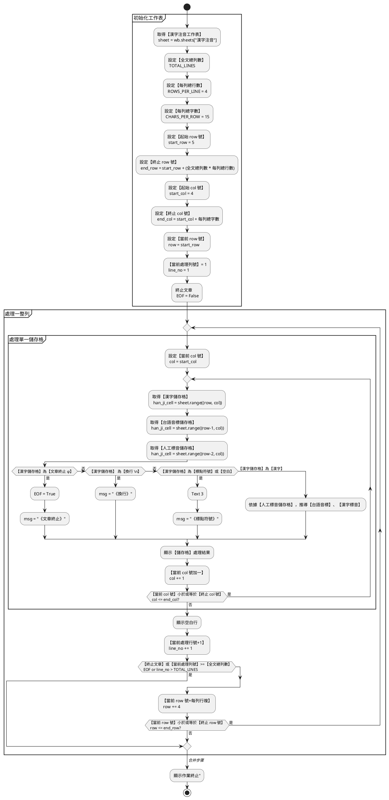
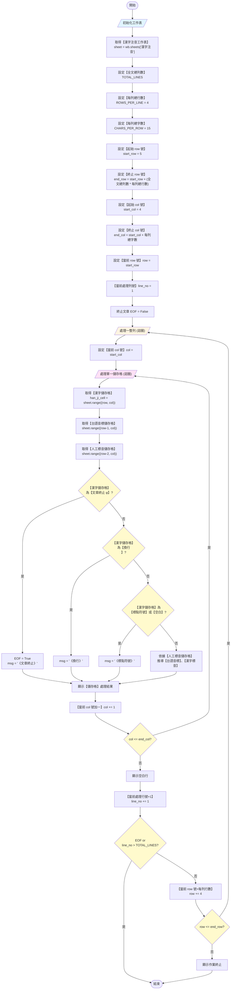

# 【漢字注音】工作表各單一儲存格處理邏輯

## PlantUML 版本

```plantuml

@startuml
start
partition 初始化工作表 {
    :取得【漢字注音工作表】\n sheet = wb.sheets["漢字注音"];

    :設定【全文總列數】\n TOTAL_LINES;
    :設定【每列總行數】\n ROWS_PER_LINE = 4;
    :設定【每列總字數】\n CHARS_PER_ROW = 15;
    :設定【起始 row 號】\n start_row = 5;
    :設定【終止 row 號】\n end_row = start_row + (全文總列數 * 每列總行數);
    :設定【起始 col 號】\n start_col = 4;
    :設定【終止 col 號】\n  end_col = start_col + 每列總字數;


    :設定【當前 row 號】\n row = start_row;
    :【當前處理列號】= 1\n line_no = 1;
    :終止文章\n EOF = False;
}

group 處理一整列 {
    repeat
        group 處理單一儲存格
            :設定【當前 col 號】\n col = start_col;
            repeat
                :取得【漢字儲存格】\n han_ji_cell = sheet.range((row, col));
                :取得【台語音標儲存格】\n han_ji_cell = sheet.range((row-1, col));
                :取得【人工標音儲存格】\n han_ji_cell = sheet.range((row-2, col));

                if (【漢字儲存格】為【文章終止 φ】) then (是)
                    :EOF = True;
                    :msg = "《文章終止》";
                (否) elseif (【漢字儲存格】 為【換行 \\n】) then (是)
                    :msg = "《換行》";
                (否) elseif (【漢字儲存格】為【標點符號】或【空白】) then (是)
                    :Text 3;
                    :msg = "《標點符號》";
                else (【漢字儲存格】為【漢字】)
                    :依據【人工標音儲存格】，推導【台語音標】、【漢字標音】;
                endif
                :顯示【儲存格】處理結果;
                :【當前 col 號加一】\n col += 1;
            repeat while (【當前 col 號】小於或等於【終止 col 號】\n col <= end_col?) is (是) not (否)
        end group

        :顯示空白行;
        :【當前處理行號+1】\n line_no += 1;
        if (【終止文章】或【當前處理列號】>=【全文總列數】\n EOF or line_no > TOTAL_LINES) then (是)
            break
        endif
        :【當前 row 號+每列行複】\n row += 4;
    repeat while (【當前 row 號】小於或等於【終止 row 號】\n row <= end_row?) is (是) not (否)
    ->//合并步骤//;
end group

:顯示作業終止";

stop
@enduml
```

## Mermaid 版本

```mermaid
flowchart TD
    Start([開始]) --> Init[/"初始化工作表"/]

    Init --> A1["取得【漢字注音工作表】<br/>sheet = wb.sheets['漢字注音']"]
    A1 --> A2["設定【全文總列數】TOTAL_LINES"]
    A2 --> A3["設定【每列總行數】ROWS_PER_LINE = 4"]
    A3 --> A4["設定【每列總字數】CHARS_PER_ROW = 15"]
    A4 --> A5["設定【起始 row 號】start_row = 5"]
    A5 --> A6["設定【終止 row 號】<br/>end_row = start_row + (全文總列數 * 每列總行數)"]
    A6 --> A7["設定【起始 col 號】start_col = 4"]
    A7 --> A8["設定【終止 col 號】<br/>end_col = start_col + 每列總字數"]
    A8 --> A9["設定【當前 row 號】row = start_row"]
    A9 --> A10["【當前處理列號】line_no = 1"]
    A10 --> A11["終止文章 EOF = False"]

    A11 --> LoopLine[/"處理一整列 (迴圈)"/]

    LoopLine --> B1["設定【當前 col 號】col = start_col"]
    B1 --> LoopCell[/"處理單一儲存格 (迴圈)"/]

    LoopCell --> C1["取得【漢字儲存格】<br/>han_ji_cell = sheet.range((row, col))"]
    C1 --> C2["取得【台語音標儲存格】<br/>sheet.range((row-1, col))"]
    C2 --> C3["取得【人工標音儲存格】<br/>sheet.range((row-2, col))"]

    C3 --> Check1{"【漢字儲存格】<br/>為【文章終止 φ】?"}
    Check1 -->|是| D1["EOF = True<br/>msg = '《文章終止》'"]
    Check1 -->|否| Check2{"【漢字儲存格】<br/>為【換行 \n】?"}
    Check2 -->|是| D2["msg = '《換行》'"]
    Check2 -->|否| Check3{"【漢字儲存格】為<br/>【標點符號】或【空白】?"}
    Check3 -->|是| D3["msg = '《標點符號》'"]
    Check3 -->|否| D4["依據【人工標音儲存格】<br/>推導【台語音標】、【漢字標音】"]

    D1 --> E1["顯示【儲存格】處理結果"]
    D2 --> E1
    D3 --> E1
    D4 --> E1

    E1 --> E2["【當前 col 號加一】col += 1"]
    E2 --> CheckCol{"col <= end_col?"}
    CheckCol -->|是| LoopCell
    CheckCol -->|否| F1["顯示空白行"]

    F1 --> F2["【當前處理行號+1】line_no += 1"]
    F2 --> CheckEOF{"EOF or<br/>line_no > TOTAL_LINES?"}
    CheckEOF -->|是| End
    CheckEOF -->|否| F3["【當前 row 號+每列行數】row += 4"]

    F3 --> CheckRow{"row <= end_row?"}
    CheckRow -->|是| LoopLine
    CheckRow -->|否| G1["顯示作業終止"]

    G1 --> End([結束])

    style Init fill:#e1f5ff
    style LoopLine fill:#fff4e1
    style LoopCell fill:#ffe1f5
    style Check1 fill:#fffacd
    style Check2 fill:#fffacd
    style Check3 fill:#fffacd
    style CheckCol fill:#fffacd
    style CheckEOF fill:#fffacd
    style CheckRow fill:#fffacd
```
