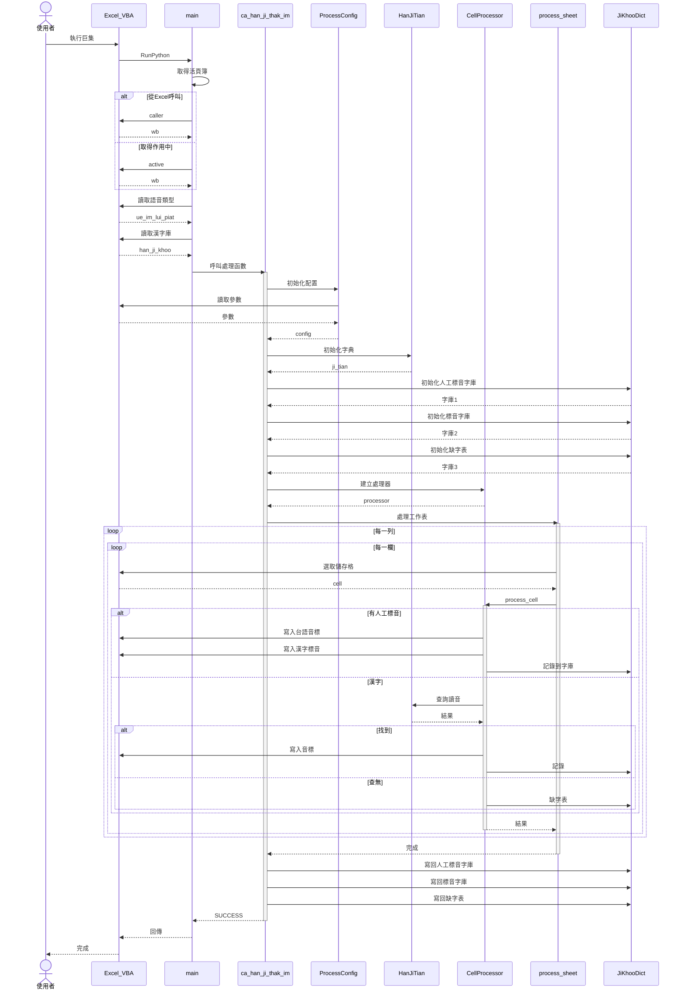

# a210 循序圖

為【漢字】自【漢字庫】查找【台語音標】，並以此轉換成【漢字標音】；但在遇有【人工標音】時，則不用在漢字庫查找【台語音標】，而是改以【人工標音】，轉換成【漢字標音】。

## 主要流程：

1. 初始化階段

    - 取得 Excel 活頁簿
    - 讀取配置參數（語音類型、漢字庫）
    - 初始化資料庫連接

2. 準備階段

    - 建立配置物件（ProcessConfig）
    - 初始化字典查詢（HanJiTian）
    - 載入三個字庫（人工標音、標音、缺字表）

3. 處理階段

    - 逐列逐欄掃描 Excel 儲存格
    - 判斷內容類型（人工標音/漢字/特殊字元）
    - 查詢資料庫取得讀音
    - 寫入音標到 Excel

4. 完成階段

    - 儲存三個字庫到 Excel 工作表
    - 回傳處理結果

## 關鍵決策點：

✅ 有人工標音 → 優先使用
✅ 查到讀音 → 寫入標音字庫
❌ 查無讀音 → 記錄到缺字表
🔚 遇到 φ → 結束處理

## 循序圖

