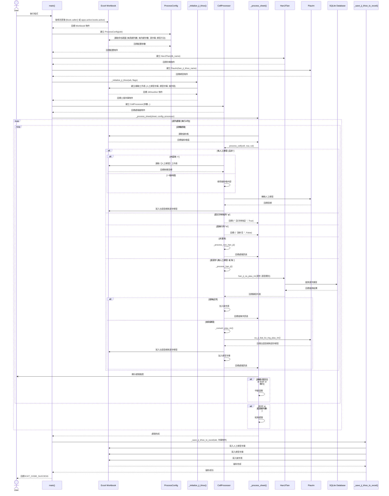

# 程式說明文件 a210_無人工標音漢字查找

為【漢字】自【漢字庫】查找【台語音標】，並以此轉換成【漢字標音】。

若遇有【人工標音】（且內容不為 `#`）時，則優先採用：
1. 若內容為 `=`：自【人工標音】工作表查找。
2. 若為其他內容：直接以該內容作為【台語音標】。

若【人工標音】為 `#` 或空白，則依據【漢字庫】進行查找。

```mermaid
sequenceDiagram
    actor User
    participant Main as main()
    participant Excel as Excel Workbook
    participant Config as ProcessConfig
    participant Init as _initialize_ji_khoo()
    participant Processor as CellProcessor
    participant Process as _process_sheet()
    participant JiTian as HanJiTian
    participant PiauIm as PiauIm
    participant DB as SQLite Database
    participant Save as _save_ji_khoo_to_excel()

    User->>Main: 執行程式
    Main->>Excel: 取得活頁簿 (Book.caller() 或 apps.active.books.active)
    Excel-->>Main: 回傳 Workbook 物件

    Main->>Config: 建立 ProcessConfig(wb)
    Config->>Excel: 讀取命名範圍 (每頁總列數, 每列總字數, 漢字庫, 標音方法)
    Excel-->>Config: 回傳配置參數
    Config-->>Main: 回傳配置物件

    Main->>JiTian: 建立 HanJiTian(db_name)
    JiTian-->>Main: 回傳字典物件

    Main->>PiauIm: 建立 PiauIm(han_ji_khoo_name)
    PiauIm-->>Main: 回傳標音物件

    Main->>Init: _initialize_ji_khoo(wb, flags)
    Init->>Excel: 建立/讀取工作表 (人工標音字庫, 標音字庫, 缺字表)
    Excel-->>Init: 回傳 JiKhooDict 物件
    Init-->>Main: 回傳三個字庫物件

    Main->>Processor: 建立 CellProcessor(參數...)
    Processor-->>Main: 回傳處理器物件

    Main->>Process: _process_sheet(sheet, config, processor)

    loop 逐列處理 (每行4列)
        loop 逐欄處理
            Process->>Excel: 讀取儲存格
            Excel-->>Process: 回傳儲存格值

            Process->>Processor: process_cell(cell, row, col)

            alt 有人工標音 (且非 '#')
                alt 內容為 '='
                    Processor->>Excel: 讀取【人工標音】工作表
                    Excel-->>Processor: 回傳對應音標
                else 一般內容
                    Processor->>Processor: 使用儲存格內容
                end
                Processor->>PiauIm: 轉換人工標音
                PiauIm-->>Processor: 回傳音標
                Processor->>Excel: 寫入台語音標與漢字標音

            else 是文字終結符 'φ'
                Processor-->>Process: 回傳 ("【文字終結】", True)

            else 是換行符 '\n'
                Processor-->>Process: 回傳 ("【換行】", False)

            else 非漢字
                Processor->>Processor: _process_non_han_ji()
                Processor-->>Process: 回傳處理訊息

            else 是漢字 (無人工標音 或 為 '#')
                Processor->>Processor: _process_han_ji()
                Processor->>JiTian: han_ji_ca_piau_im(漢字, 語音類別)
                JiTian->>DB: 查詢漢字讀音
                DB-->>JiTian: 回傳查詢結果
                JiTian-->>Processor: 回傳讀音列表

                alt 查無此字
                    Processor->>Processor: 加入缺字表
                    Processor-->>Process: 回傳查無字訊息
                else 查到讀音
                    Processor->>Processor: _convert_piau_im()
                    Processor->>PiauIm: ca_ji_kiat_ko_tng_piau_im()
                    PiauIm-->>Processor: 回傳台語音標與漢字標音
                    Processor->>Excel: 寫入台語音標與漢字標音
                    Processor->>Processor: 加入標音字庫
                    Processor-->>Process: 回傳處理訊息
                end
            end

            Process->>User: 顯示處理進度

            alt 連續2個空白 or EOF or 換行
                Process->>Process: 中斷迴圈
            end
        end

        alt EOF or 超過總列數
            Process->>Process: 結束處理
        end
    end

    Process-->>Main: 處理完成

    Main->>Save: _save_ji_khoo_to_excel(wb, 字庫物件)
    Save->>Excel: 寫入人工標音字庫
    Save->>Excel: 寫入標音字庫
    Save->>Excel: 寫入缺字表
    Excel-->>Save: 儲存完成
    Save-->>Main: 儲存成功

    Main-->>User: 回傳 EXIT_CODE_SUCCESS
```