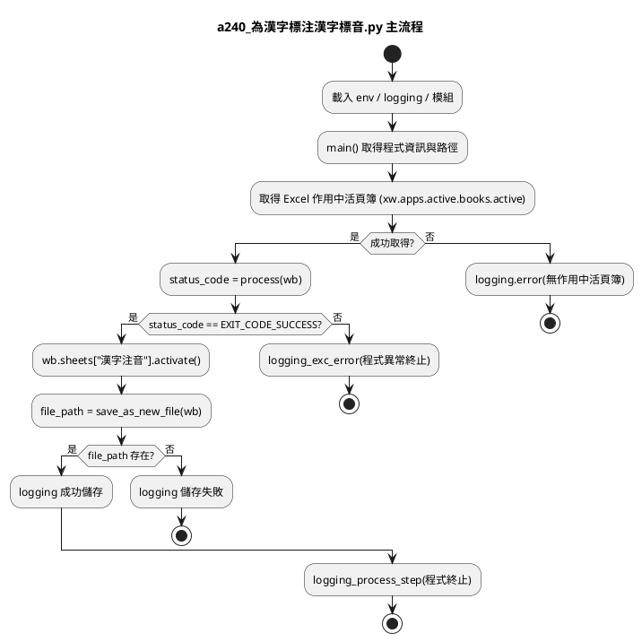
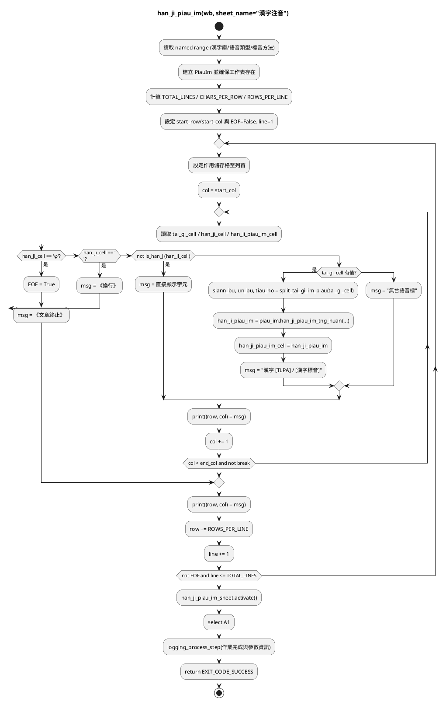
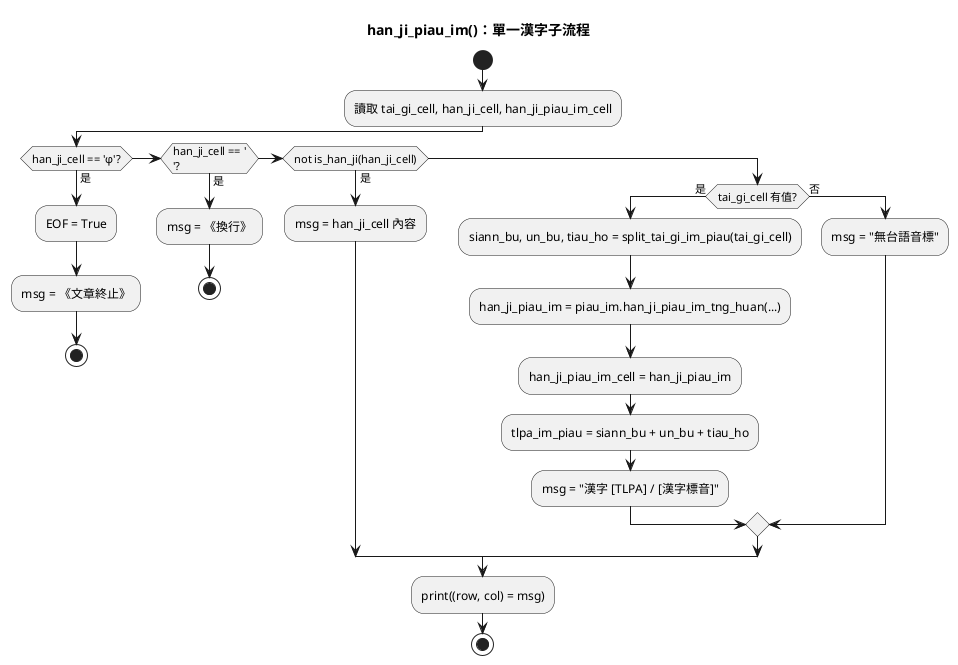

# 程式說明文件 a240 為漢字標注漢字標音

## 主流程

## han_ji_piau_im()

### 主流程

- 初始化：讀取命名範圍、建立 PiauIm、鎖定處理範圍與旗標。
- 逐列逐欄：檢查結束標記/換行/非漢字，或拆解台語音標後寫回漢字標音並印出訊息。
- 結束處理：離開巢狀迴圈、回到表頭、寫入日誌，回傳 EXIT_CODE_SUCCESS。

### 子流程：處理單一漢字

「處理單一漢字」子流程，專注在 han_ji_piau_im() 內針對每個 (row, col) 位置的判斷與動作。

- 讀出對應的台語音標儲存格、漢字儲存格、漢字標音儲存格。
- 若遇 φ、換行或非漢字，直接設定訊息並結束當前欄位。
- 若為漢字且有台語音標，則拆解聲母/韻母/調號，呼叫 piau_im.han_ji_piau_im_tng_huan() 取得漢字標音並寫回儲存格。
- 所有分支都會留下 msg，最後印出 (row, col) 與 msg。

