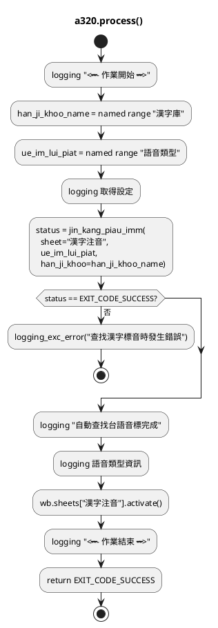
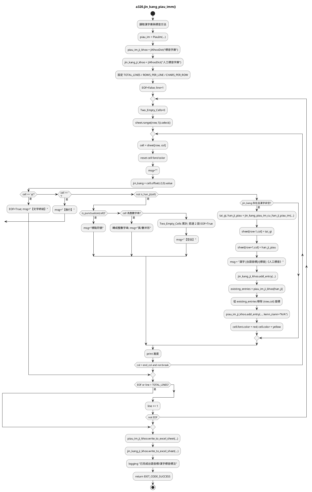
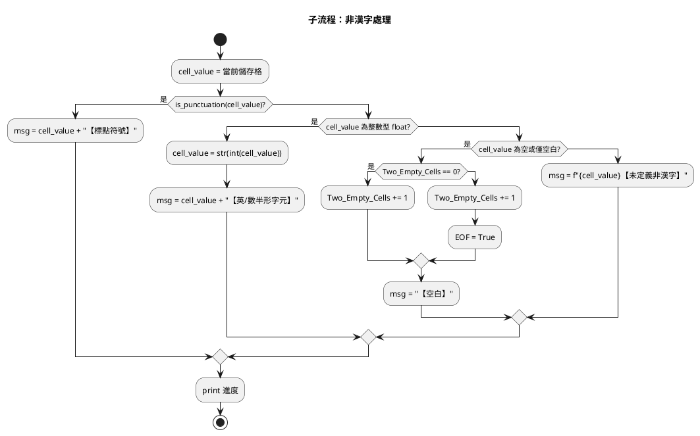
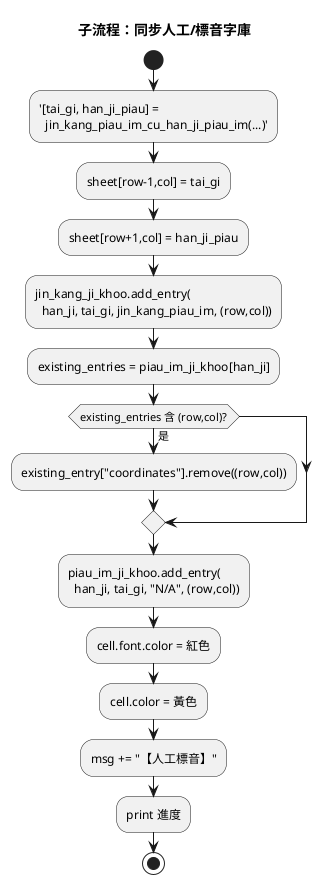

# 程式說明文件 a320 人工標音更正漢字自動標音

## process()

流程總覽

- process()：初始化 → 呼叫 jin_kang_piau_imm() 生成台語/漢字標音 → 記錄完成並返回成功碼。
- jin_kang_piau_imm()：建置字庫 → 逐列逐欄判斷 φ/換行/標點/空白 → 對有人工標音的漢字轉換 TLPA 與漢字標音、同步到兩個字庫 → 寫回 Excel 並記錄進度。

## jin_kang_piau_im()

## 非漢字處理

## 同步人工/標音字庫

