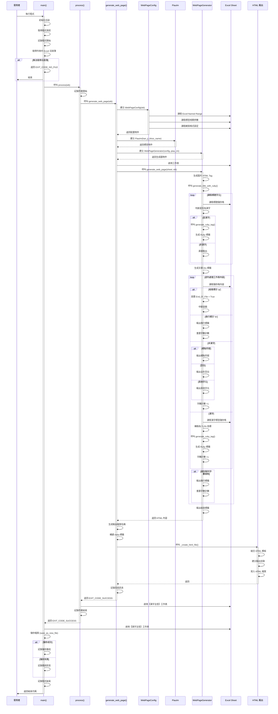
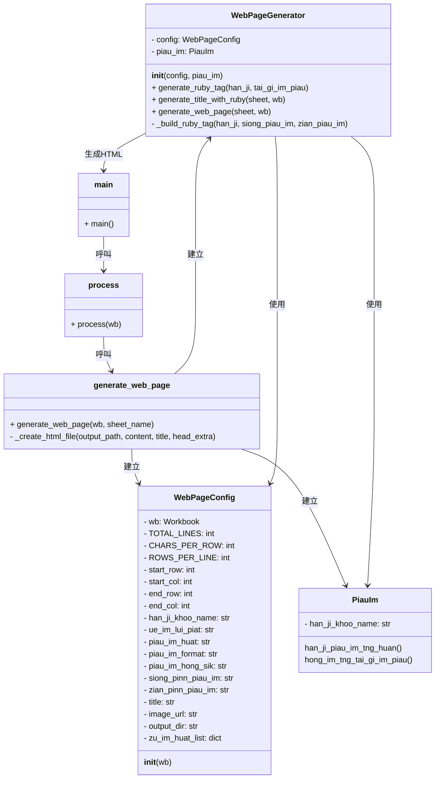
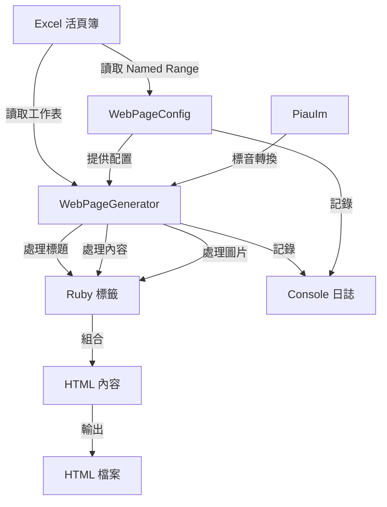

# 程式說明文件 a401 Generate Web Page

根據【漢字注音】工作表轉製漢字標音【網頁】。

## 程式架構

1. 配置類別 WebPageConfig

    - 集中管理所有 Excel 配置參數（列數、欄數、標音方式等）
    - 初始化時自動從 Excel Named Range 讀取設定

2. 網頁生成器類別 WebPageGenerator

    - 專職負責 Ruby 標籤生成
    - 處理標題製作
    - 產生完整網頁內容
    - 分離邏輯關切點，便於測試和維護

3. 結構化函數組織

    - generate_web_page() - 主要處理函數
    - process() - 作業流程控制
    - main() - 程式入口

4. 改善的錯誤處理與日誌

    - 完整的 Try-Except-Finally 結構
    - 明確的結束代碼定義
    - 詳細的處理步驟紀錄

5. 程式風格一致性

    - 採用 a210 的註解區隔方式
    - 相同的常數定義格式
    - 一致的函數簽名和文件字串

## 循序圖

1. 程式執行流程循序圖 - 展示完整執行流程

    - main() → process() → generate_web_page()
    - 配置初始化流程
    - 標題處理
    - 內容循環處理
    - 檔案儲存

2. Ruby 標籤生成循序圖 - 詳細的標音邏輯

    - 台語音標分解
    - 聲母判斷
    - 根據網頁格式選擇標音位置
    - Ruby 標籤生成策略

3. 類別互動關係圖 - 展示物件協作

    - WebPageConfig - 配置管理
    - PiauIm - 標音轉換
    - WebPageGenerator - 核心生成邏輯
    - 各函數的角色定位

4. 資料流向圖 - 從輸入到輸出

    - Excel 資料讀取
    - 配置流轉
    - 標音轉換
    - HTML 生成和輸出



## WebPageGenerator 內部流程 - Ruby 標籤生成

```mermaid
sequenceDiagram
    participant Generator as WebPageGenerator
    participant PiauIm as PiauIm
    participant RubyTag as Ruby標籤

    Generator->>Generator: generate_ruby_tag(han_ji, tai_gi_im_piau)

    Generator->>Generator: 分解台語音標
    Generator->>Generator: split_tai_gi_im_piau()
    Generator->>Generator: 取得聲母、韻母、聲調

    alt 聲母為空
        Generator->>Generator: 設置聲母為 "ø"
    else 聲母存在
        Generator->>Generator: 使用讀取的聲母
    end

    alt 網頁格式為「無預設」
        alt 標音方式為「上及右」
            Generator->>PiauIm: 呼叫 han_ji_piau_im_tng_huan()
            PiauIm-->>Generator: 返回上方標音
            Generator->>PiauIm: 呼叫 han_ji_piau_im_tng_huan()
            PiauIm-->>Generator: 返回右方標音
        else 標音方式為「上」
            Generator->>PiauIm: 呼叫 han_ji_piau_im_tng_huan()
            PiauIm-->>Generator: 返回上方標音
        else 標音方式為「右」
            Generator->>PiauIm: 呼叫 han_ji_piau_im_tng_huan()
            PiauIm-->>Generator: 返回右方標音
        end
    else 網頁格式為特定類型
        alt 格式為 POJ/TL/BP/TLPA_Plus/SNI
            Generator->>PiauIm: 呼叫 han_ji_piau_im_tng_huan()
            PiauIm-->>Generator: 返回上方標音
        else 格式為 TPS
            Generator->>PiauIm: 呼叫 han_ji_piau_im_tng_huan()
            PiauIm-->>Generator: 返回右方標音
        else 格式為 DBL
            Generator->>PiauIm: 呼叫 han_ji_piau_im_tng_huan()
            PiauIm-->>Generator: 返回上方標音
            Generator->>PiauIm: 呼叫 han_ji_piau_im_tng_huan()
            PiauIm-->>Generator: 返回右方標音
        end
    end

    Generator->>Generator: _build_ruby_tag(han_ji, siong_piau_im, zian_piau_im)

    alt 僅上方標音
        Generator->>RubyTag: 生成上方標籤 &lt;rt&gt;
    else 僅右方標音
        Generator->>RubyTag: 生成右方標籤 &lt;rtc&gt;
    else 上方及右方標音
        Generator->>RubyTag: 生成上方 &lt;rt&gt; + 右方 &lt;rtc&gt;
    else 無標音
        Generator->>RubyTag: 生成純文字 &lt;span&gt;
    end

    RubyTag-->>Generator: 返回 Ruby HTML 標籤

```

## 類別互動關係圖



## 資料流向圖



