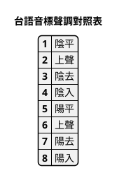
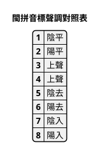

# mod_convert_TLPA_to_BP 程式說明文件

## 零聲母+介音（i/u）處理規則

若是【聲母】為空（或稱：零聲母），遇【韻母】的【羅馬拼音字母】為【i】，或【u】時，需對【聲母】進行調整變更：

1. 【韻母】的【第一個羅馬拼音字母】為【i】：
    1.1. 【i】後無其它【韻母羅馬拼音字母】：如：依【i1】、因【in1】，將【聲母】改為【y】，原拼音改成：依【yi1】、因【yin1】；
    1.2. 【i】後有其它【韻母羅馬拼音字母】：如：鴉【ia1】、煙【ian1】，將【聲母】改為【y】，原先的【i】消除，原拼音改成：鴉【ya1】、煙【yan1】；

2. 【韻母】的【第一個羅馬拼音字母】為【u】：
    2.1. 【u】後無其它【韻母羅馬拼音字母】：如：烏【u1】、溫【un1】，將【聲母】改為【w】，原拼音改成：烏【wu1】、溫【wun1】；
    2.2. 【u】後有其它【韻母羅馬拼音字母】：如：蛙【ua1】、彎【uan1】，將【聲母】改為【w】，原先的【i】消除，原拼音改成：蛙【wa1】、彎【wan1】。

## 程式碼規劃

【零聲母 + i/u】規則修正程式，重點如下：

### 零聲母 + i：

- 若 i 後面接母音（a/e/i/o/u），則把 i 移到聲母，改成 y，並消去原先韻母開頭的 i（例：ia1 → ya1, ian1 → yan1）。

- 若 i 後面不接母音（如 i1, in1, inn1），則在韻母前補 y（例：i1 → yi1, in1 → yin1）。

### 零聲母 + u：

- 若 u 後面接母音（a/e/i/o/u），則把 u 移到聲母，改成 w，並消去原先韻母開頭的 u（例：ua1 → wa1, uan1 → wan1）。

- 若 u 後面不接母音（如 u1, un1, unn1），則在韻母前補 w（例：u1 → wu1, un1 → wun1）。

### 處理邏輯

零聲母遇到 i/u 時要分兩種情況處理：

- i/u 後面還有母音（a/e/i/o/u）：把 i→y 或 u→w 移到聲母，並刪掉韻母開頭的 i/u。
例：ia1 → onset=y, rest=a1 → ya1；uan1 → onset=w, rest=an1 → wan1。

- i/u 後面沒有母音（如 i1, in1, u1, un7 …）：把 i→y 或 u→w 移到聲母，但保留韻母原本的 i/u。
例：i1 → yi1、in1 → yin1、u1 → wu1、un7 → wun7。

## 測試規劃

漢字    TLPA音標    BP音標
- 依 【i1】--> 【yi1】
- 因 【in1】--> 【yin1】
- 鴉 【ia1】--> 【ya1】
- 煙 【ian1】--> 【yan1】
- 用 【iong7】--> 【yong7】

- 烏 【u1】--> 【wu1】
- 運 【un7】--> 【wun7】
- 媧 【ua1】--> 【wa1】
- 彎 【uan1】--> 【wan1】

## 調號轉換

台語音標（TLPA+）聲調之【調號】，轉換成【閩拼音標】（BP）。

