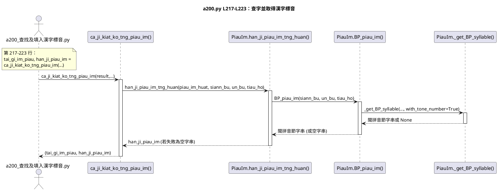
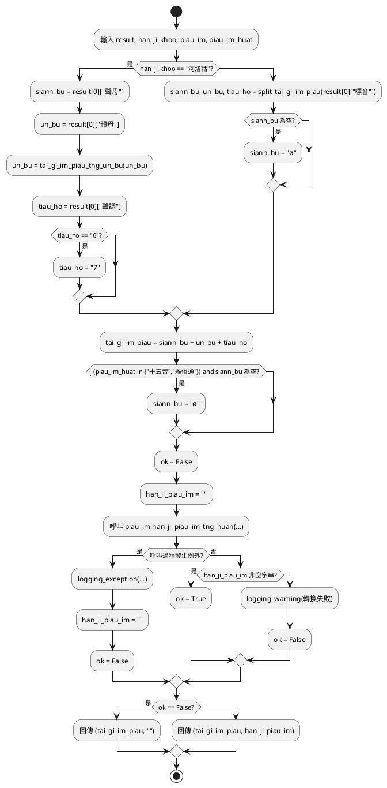
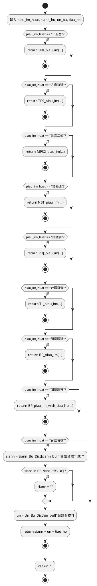
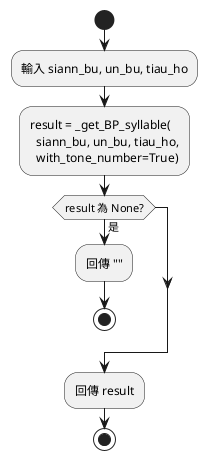
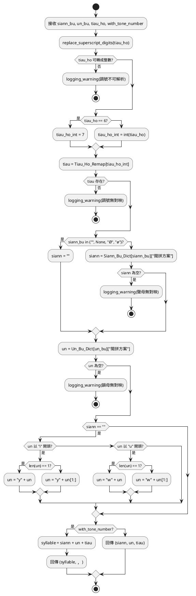

# 程式碼指引 mod_標音

## a200_查找及填入漢字標音

循序圖

## 【mod_標音】模組

### def ca_ji_kiat_ko_tng_piau_im()

查字結果轉標音：利用【查漢字庫】所得之【台語音標】，於指明【漢字標音法】後，生成所欲引用之
【漢字標音】。

流程概述

- 依 han_ji_khoo 判定為「河洛話」或「文讀音」，分別取得聲母、韻母、調號；河洛話需進行韻母轉換並將調號 6→7。
- 將 siann_bu + un_bu + tiau_ho 合併成 tai_gi_im_piau。
- 若標音法為「十五音/雅俗通」且聲母為空，補為 ø。
- 呼叫 piau_im.han_ji_piau_im_tng_huan() 嘗試轉換，成功則 ok=True，否則記錄警告或例外並保持 ok=False。
- 最後依 ok 真假回傳 (tai_gi_im_piau, "") 或 (tai_gi_im_piau, han_ji_piau_im)。

---

### Piau_Im.han_ji_piau_im_tng_huan()

轉換【漢字標音】

流程概念

- 讀入 piau_im_huat、siann_bu、un_bu、tiau_ho。
- 依照 piau_im_huat 逐一判斷：十五音 / 方音符號 / 注音二式 / 雅俗通 / 白話字 / 台羅 / 閩拼調號 / 閩拼調符 / 台語音標。
- 命中對應分支就呼叫對應轉換函式並立刻回傳。
- 若是「台語音標」，先從字典取聲母韻母後組合並回傳。
- 若都不符合，最後回傳空字串。

### Piau_Im.BP_piau_im()

呼叫內部轉換 → 檢查 None → 回傳字串

若 _get_BP_syllable() 在轉換成【漢字標音】過程，發生【執行時期錯誤】，
該函數會進行【意外處理(Exception)】，抑止程式因而中斷；但函數會返回 None 值。

外部函數可據此 None 值，判斷返回值，當看成（聲、韻、調）Tumple？還是轉換不成功
的結果。若遇轉換不成功，則回傳【空字串】以表無法依據傳入函數之參數：聲母、韻母、調號
及拚音系統名，轉換成【漢字標音】。

### Piau_Im._get_BP_syllable()

流程重點

- 先將上標調號轉成一般數字並嘗試轉成 int；若失敗則記錄警告並回傳 None。
- 依 Tiau_Ho_Remap 對映調號；若無法對映同樣記錄警告並回傳 None。
- 聲母為空 (""/None/Ø/ø) 則設為空字串；否則從 Siann_Bu_Dict 查表，若結果為空則回傳 ("", "", "")。
- 韻母從 Un_Bu_Dict 查表，查不到也回傳 ("", "", "")。
- 若為零聲母且韻母以 i 或 u 起頭，依規則改為 y/w 開頭。
- with_tone_number=True 時回傳單一字串（其他兩欄留空）；否則回傳 (siann, un, tiau)。

