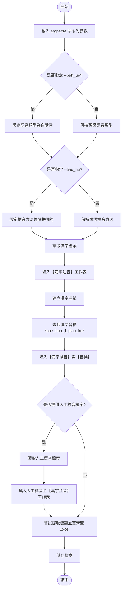
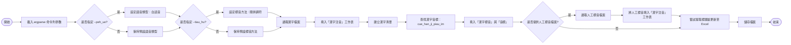
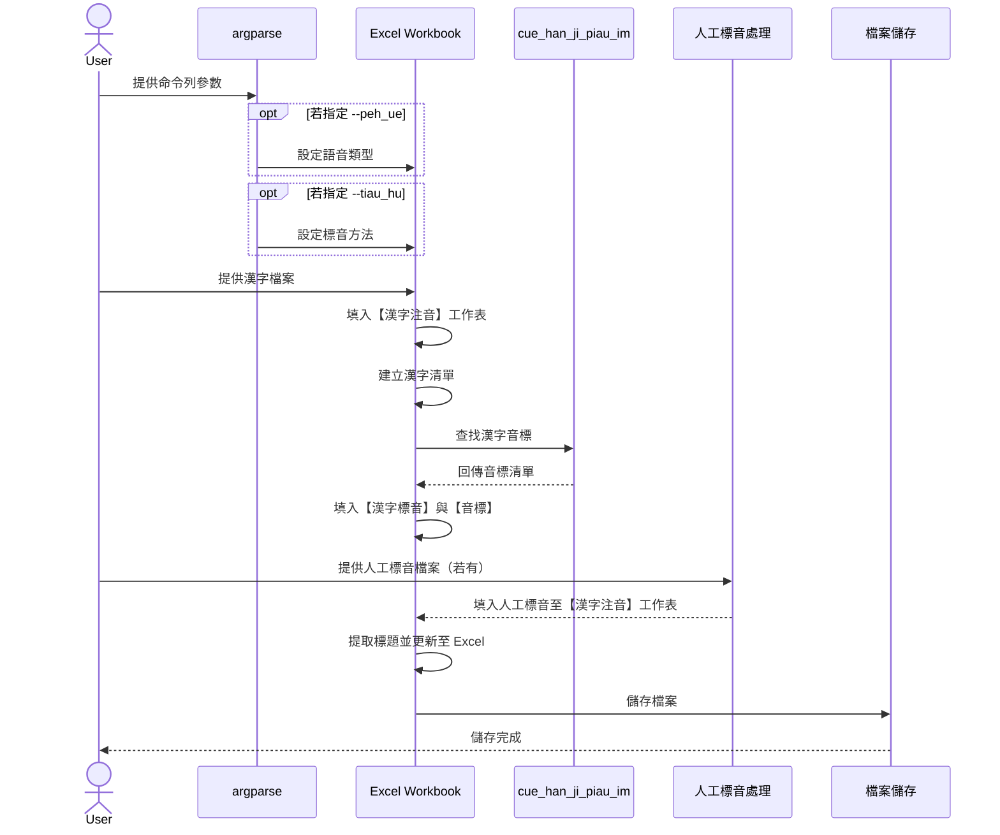

# a110 程式文件

a110_使用漢字文字檔流程圖

## 作業流程

```mermaid
flowchart TD
    A([開始]) --> B[載入 argparse 命令列參數]

    B --> C{是否指定 --peh_ue?}
    C -->|是| D[設定語音類型為白話音]
    C -->|否| E[保持預設語音類型]

    D --> F{是否指定 --tiau_hu?}
    E --> F

    F -->|是| G[設定標音方法為閩拼調符]
    F -->|否| H[保持預設標音方法]

    G --> I[讀取漢字檔案]
    H --> I

    I --> J[填入【漢字注音】工作表]
    J --> K[建立漢字清單]
    K --> L[查找漢字音標（cue_han_ji_piau_im）]
    L --> M[填入【漢字標音】與【音標】]

    M --> N{是否提供人工標音檔案?}
    N -->|是| O[讀取人工標音檔案]
    O --> P[填入人工標音至【漢字注音】工作表]
    P --> Q[嘗試提取標題並更新至 Excel]
    N -->|否| Q

    Q --> R[儲存檔案]
    R --> S([結束])
```

```mermaid
flowchart LR
    A([開始]) --> B[載入 argparse 命令列參數]

    B --> C{是否指定 --peh_ue?}
    C -- 是 --> D[設定語音類型：白話音]
    C -- 否 --> E[保持預設語音類型]

    D --> F{是否指定 --tiau_hu?}
    E --> F

    F -- 是 --> G[設定標音方法：閩拼調符]
    F -- 否 --> H[保持預設標音方法]

    G --> I[讀取漢字檔案]
    H --> I

    I --> J[填入「漢字注音」工作表]
    J --> K[建立漢字清單]
    K --> L[查找漢字音標：cue_han_ji_piau_im]
    L --> M[填入「漢字標音」與「音標」]

    M --> N{是否提供人工標音檔案?}
    N -- 是 --> O[讀取人工標音檔案]
    O --> P[將人工標音填入「漢字注音」工作表]
    P --> Q[嘗試提取標題並更新至 Excel]
    N -- 否 --> Q

    Q --> R[儲存檔案]
    R --> S([結束])
```

## 循序圖

```mermaid
sequenceDiagram
    actor User as User
    participant Argparse as argparse
    participant Workbook as Excel Workbook
    participant CueHanJi as cue_han_ji_piau_im
    participant ManualPiauIm as 人工標音處理
    participant SaveFile as 檔案儲存

    User->>Argparse: 提供命令列參數
    opt 若指定 --peh_ue
        Argparse->>Workbook: 設定語音類型
    end
    opt 若指定 --tiau_hu
        Argparse->>Workbook: 設定標音方法
    end

    User->>Workbook: 提供漢字檔案
    Workbook->>Workbook: 填入【漢字注音】工作表
    Workbook->>Workbook: 建立漢字清單

    Workbook->>CueHanJi: 查找漢字音標
    CueHanJi-->>Workbook: 回傳音標清單
    Workbook->>Workbook: 填入【漢字標音】與【音標】

    User->>ManualPiauIm: 提供人工標音檔案（若有）
    ManualPiauIm-->>Workbook: 填入人工標音至【漢字注音】工作表

    Workbook->>Workbook: 提取標題並更新至 Excel
    Workbook->>SaveFile: 儲存檔案
    SaveFile-->>User: 儲存完成
```