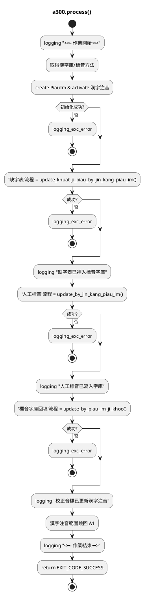
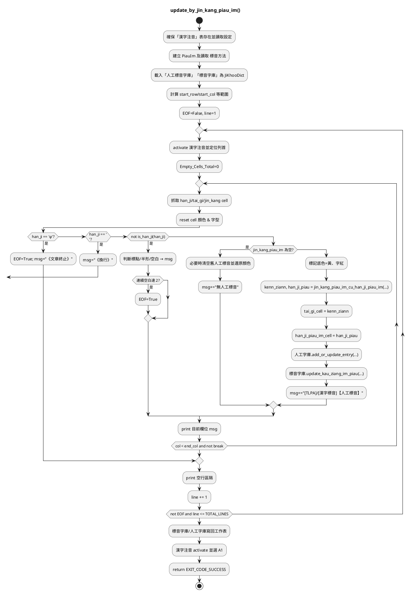

# 程式說明文件 a300 手動更正漢字標音

## process()

- 初始化：記錄開始、擷取 漢字庫 與 標音方法、建立 PiauIm、啟用 漢字注音 工作表；任一失敗直接回傳 EXIT_CODE_PROCESS_FAILURE。
- 缺字表補標音：呼叫 update_khuat_ji_piau_by_jin_kang_piau_im()，將缺字表資料同步到標音字庫；失敗即終止。
- 人工標音回填：呼叫 update_by_jin_kang_piau_im()，把「漢字注音」表的人工標音寫入字庫並反映在工作表。
- 校正音標覆寫：呼叫 update_by_piau_im_ji_khoo()，以標音字庫內的校正音標覆蓋「漢字注音」表的台語音標/漢字標音。
- 收尾：選取 A1、記錄結束訊息、回傳 EXIT_CODE_SUCCESS。

## update_by_jin_kang_piau_im()

- 初始化：鎖定「漢字注音」表、讀取 漢字庫／標音方法，建立 PiauIm。建立「人工標音字庫」「標音字庫」兩個 JiKhooDict。
- 設定表格範圍並進入雙層迴圈（行→列），逐一取出漢字、台語音標、人工標音儲存格，並先還原底色字色。
- 結束條件：遇 φ 設 EOF=True，遇 \n 視為換行跳出本列。對非漢字再判斷標點 / 英數 / 空白並計數空白行。
- 若為漢字：
- 無人工標音：若儲存格仍有舊值則清空並還原樣式。
- 有人工標音：標註底色，透過 jin_kang_piau_im_cu_han_ji_piau_im() 轉換成台語音標 + 漢字標音，寫回儲存格。
- 同步字庫：jinkang 字庫記錄 add_or_update_entry()；piau_im_ji_khoo.update_kau_ziang_im_piau() 更新校正音標。
- 內層每欄列印進度，外層每列換行，遇 EOF 或超過總行數即跳出。
- 收尾：把更新後的兩個字典寫回各自工作表，選取 A1，回傳成功。

