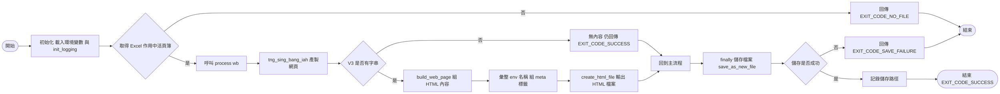
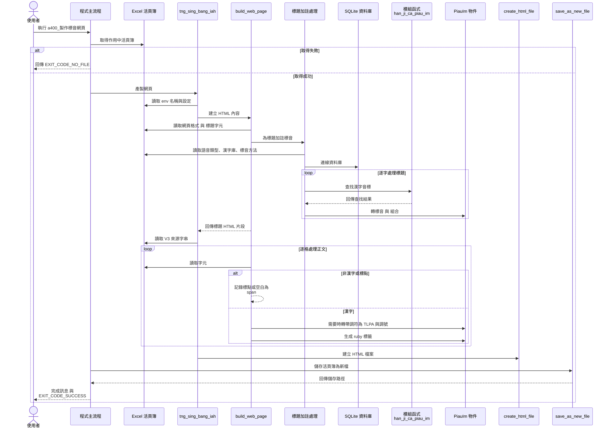

# a400 程式說明文件

依據【漢字注音】工作表之內容，製作成帶有漢字標音之網頁。

## 作業流程

```mermaid
%%{init: {
  "flowchart": { "useMaxWidth": false },
  "themeVariables": { "fontSize": "18px" }
}}%%
flowchart LR
    A([開始]) --> B[初始化 載入環境變數 與 init_logging]
    B --> C{取得 Excel 作用中活頁簿}
    C -- 否 --> C1[回傳 EXIT_CODE_NO_FILE] --> Z([結束])
    C -- 是 --> D[呼叫 process wb]
    D --> E[tng_sing_bang_iah 產製網頁]
    E --> F{V3 是否有字串}
    F -- 否 --> G[無內容 仍回傳 EXIT_CODE_SUCCESS] --> H[回到主流程]
    F -- 是 --> I[build_web_page 組 HTML 內容]
    I --> J[彙整 env 名稱 組 meta 標籤]
    J --> K[create_html_file 輸出 HTML 檔案]
    K --> H[回到主流程]
    H --> L[finally 儲存檔案 save_as_new_file]
    L --> M{儲存是否成功}
    M -- 否 --> M1[回傳 EXIT_CODE_SAVE_FAILURE] --> Z
    M -- 是 --> N[記錄儲存路徑]
    N --> O([結束 EXIT_CODE_SUCCESS])
```

## 循序圖

```mermaid
%%{init: {
  "sequence": { "useMaxWidth": false, "wrap": true, "actorFontSize": 20, "messageFontSize": 18, "noteFontSize": 16 },
  "themeVariables": { "fontSize": "18px" }
}}%%
sequenceDiagram
    actor User as 使用者
    participant Main as 程式主流程
    participant Excel as Excel 活頁簿
    participant TNG as tng_sing_bang_iah
    participant BUILD as build_web_page
    participant TitleSvc as 標題加註處理
    participant DB as SQLite 資料庫
    participant MOD as 模組函式 han_ji_ca_piau_im
    participant PiauIm as PiauIm 物件
    participant HTML as create_html_file
    participant SAVE as save_as_new_file

    User->>Main: 執行 a400_製作標音網頁
    Main->>Excel: 取得作用中活頁簿
    alt 取得失敗
        Main-->>User: 回傳 EXIT_CODE_NO_FILE
    else 取得成功
        Main->>TNG: 產製網頁
        TNG->>Excel: 讀取 env 名稱與設定
        TNG->>BUILD: 建立 HTML 內容

        BUILD->>Excel: 讀取網頁格式 與 標題字元
        BUILD->>TitleSvc: 為標題加註標音
        TitleSvc->>Excel: 讀取語音類型、漢字庫、標音方法
        TitleSvc->>DB: 連線資料庫
        loop 逐字處理標題
            TitleSvc->>MOD: 查找漢字音標
            MOD-->>TitleSvc: 回傳查找結果
            TitleSvc->>PiauIm: 轉標音 與 組合
        end

        BUILD-->>TNG: 回傳標題 HTML 片段
        TNG->>Excel: 讀取 V3 來源字串

        loop 逐格處理正文
            BUILD->>Excel: 讀取字元
            alt 非漢字或標點
                BUILD-->>BUILD: 記錄標點或空白為 span
            else 漢字
                BUILD->>PiauIm: 需要時轉帶調符為 TLPA 與調號
                BUILD->>PiauIm: 生成 ruby 標籤
            end
        end

        TNG->>HTML: 建立 HTML 檔案
        Main->>SAVE: 儲存活頁簿為新檔
        SAVE-->>Main: 回傳儲存路徑
        Main-->>User: 完成訊息 與 EXIT_CODE_SUCCESS
    end
```