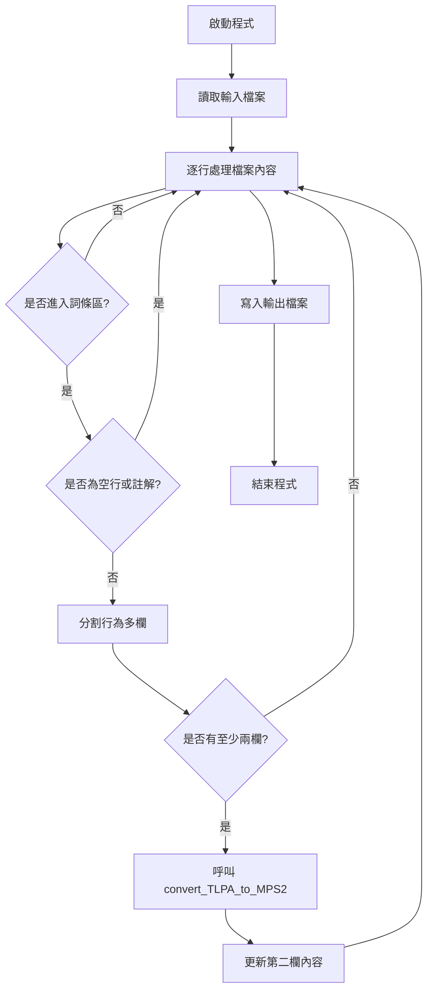
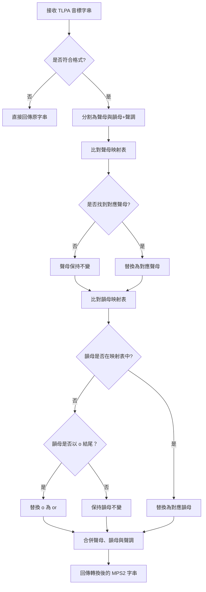
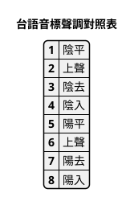
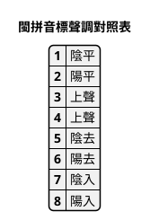
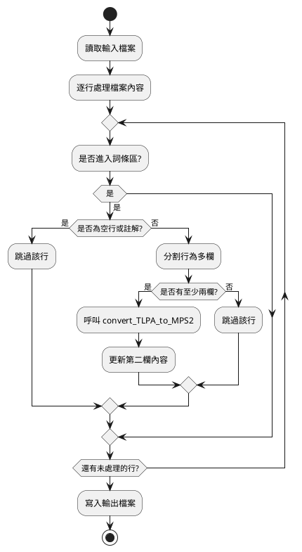
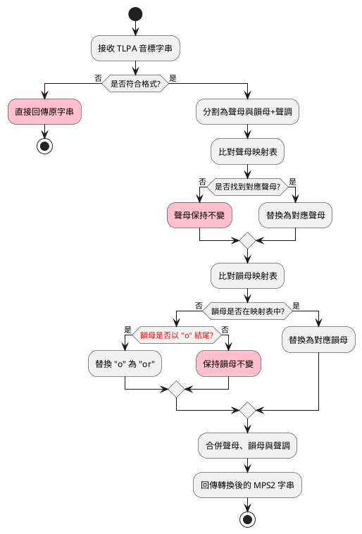

# mod_convert_TLPA_to_MPS2 程式說明文件

將文字檔中之【台語音標】轉換成【台語注音二式音標】。

## 流程圖

### 主要流程圖

### convert_TLPA_to_MPS2() 流程圖

## 台語音標【調號】轉成【台語二式音標】

## PlantUML 活動圖

想研究 PlantUML 在【流程圖】繪製之便利性。

### 主流程

### 模組：convert_TLPA_to_MPS2

