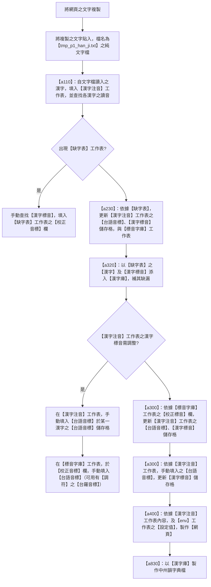
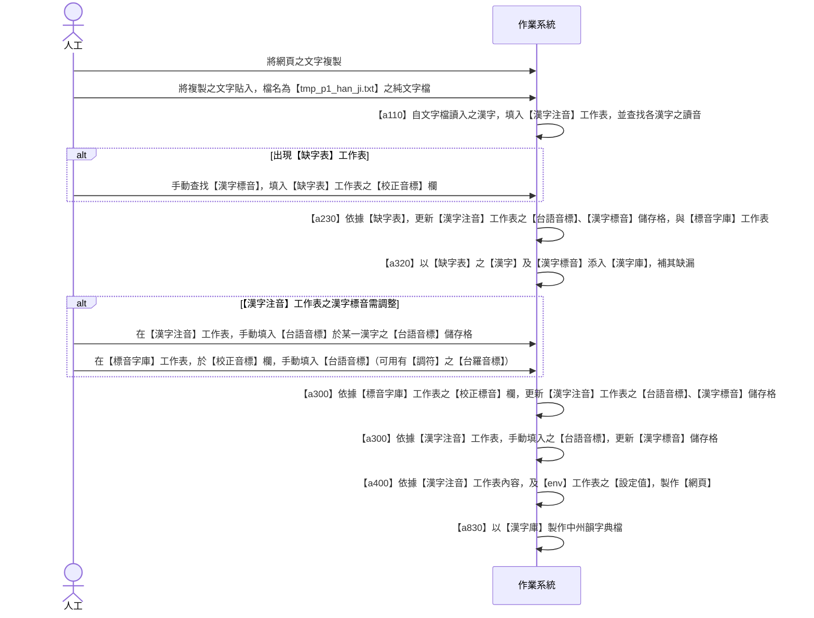

# URS-000

使用【純文字檔】，為漢字標注【讀音】。

## 作業流程

```mermaid
flowchart TD
    A[將網頁之文字複製] --> B[將複製之文字貼入，檔名為【tmp_p1_han_ji.txt】之純文字檔]
    B --> C[【a110】：自文字檔讀入之漢字，填入【漢字注音】工作表，並查找各漢字之讀音]
    C --> D{出現【缺字表】工作表?}
    D -- 是 --> E[手動查找【漢字標音】，填入【缺字表】工作表之【校正音標】欄]
    D --> F[【a230】：依據【缺字表】，更新【漢字注音】工作表之【台語音標】、【漢字標音】儲存格，與【標音字庫】工作表]
    F --> G[【a320】：以【缺字表】之【漢字】及【漢字標音】添入【漢字庫】，補其缺漏]
    G --> H{【漢字注音】工作表之漢字標音需調整?}
    H -- 是 --> I[在【漢字注音】工作表，手動填入【台語音標】於某一漢字之【台語音標】儲存格]
    I --> J[在【標音字庫】工作表，於【校正音標】欄，手動填入【台語音標】（可用有【調符】之【台羅音標】）]
    H --> K[【a300】：依據【標音字庫】工作表之【校正標音】欄，更新【漢字注音】工作表之【台語音標】、【漢字標音】儲存格]
    K --> L[【a300】：依據【漢字注音】工作表，手動填入之【台語音標】，更新【漢字標音】儲存格]
    L --> M[【a400】：依據【漢字注音】工作表內容，及【env】工作表之【設定值】，製作【網頁】]
    M --> N[【a830】：以【漢字庫】製作中州韻字典檔]
```

### 循序圖

```mermaid
sequenceDiagram
    actor 人工
    participant 作業系統

    人工 ->> 作業系統: 將網頁之文字複製
    人工 ->> 作業系統: 將複製之文字貼入，檔名為【tmp_p1_han_ji.txt】之純文字檔
    作業系統 ->> 作業系統: 【a110】自文字檔讀入之漢字，填入【漢字注音】工作表，並查找各漢字之讀音

    alt 出現【缺字表】工作表
        人工 ->> 作業系統: 手動查找【漢字標音】，填入【缺字表】工作表之【校正音標】欄
    end

    作業系統 ->> 作業系統: 【a230】依據【缺字表】，更新【漢字注音】工作表之【台語音標】、【漢字標音】儲存格，與【標音字庫】工作表
    作業系統 ->> 作業系統: 【a320】以【缺字表】之【漢字】及【漢字標音】添入【漢字庫】，補其缺漏

    alt 【漢字注音】工作表之漢字標音需調整
        人工 ->> 作業系統: 在【漢字注音】工作表，手動填入【台語音標】於某一漢字之【台語音標】儲存格
        人工 ->> 作業系統: 在【標音字庫】工作表，於【校正音標】欄，手動填入【台語音標】（可用有【調符】之【台羅音標】）
    end

    作業系統 ->> 作業系統: 【a300】依據【標音字庫】工作表之【校正標音】欄，更新【漢字注音】工作表之【台語音標】、【漢字標音】儲存格
    作業系統 ->> 作業系統: 【a300】依據【漢字注音】工作表，手動填入之【台語音標】，更新【漢字標音】儲存格
    作業系統 ->> 作業系統: 【a400】依據【漢字注音】工作表內容，及【env】工作表之【設定值】，製作【網頁】
    作業系統 ->> 作業系統: 【a830】以【漢字庫】製作中州韻字典檔
```