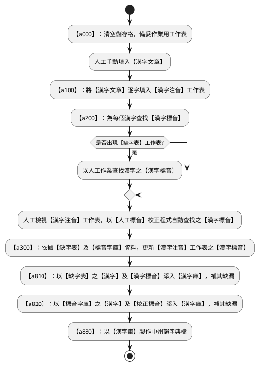
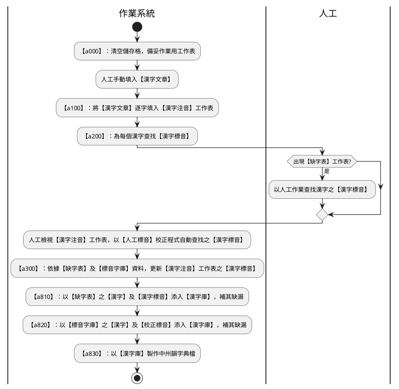
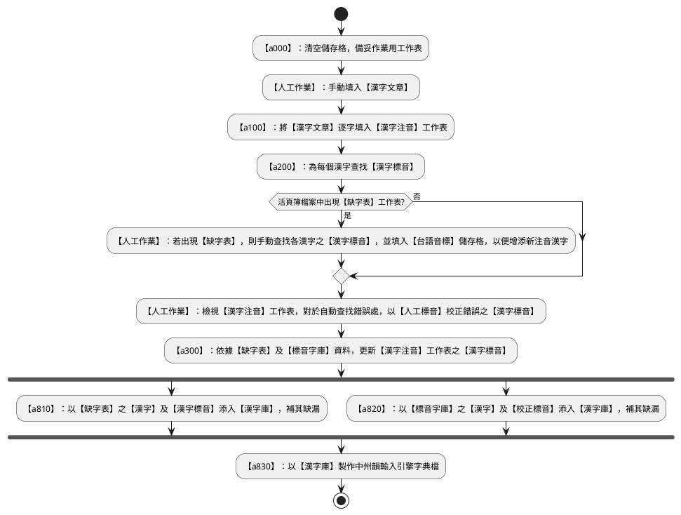

# 漢字標音作業流程

使用 PlantUML 繪製 UML 之【流程圖】與【活動圖】。

1. 【a000】：清空儲存格，備妥作業用工作表
2. 人工手動填入【漢字文章】
3. 【a100】：將【漢字文章】逐字填入【漢字注音】工作表
4. 【a200】：為每個漢字查找【漢字標音】
5. 若出現【缺字表】工作表，則以人工作業查找漢字之【漢字標音】
6. 人工檢視【漢字注音】工作表，以【人工標音】校正程式自動查找之【漢字標音】
7. 【a300】：依據【缺字表】及【標音字庫】資料，更新【漢字注音】工作表之【漢字標音】
8. 【a810】：以【缺字表】之【漢字】及【漢字標音】添入【漢字庫】，補其缺漏
9. 【a820】：以【標音字庫】之【漢字】及【校正標音】添入【漢字庫】，補其缺漏
10. 【a830】：以【漢字庫】製作中州韻字典檔

## 流程圖

### 活動圖

### DeepSeek 活動圖

