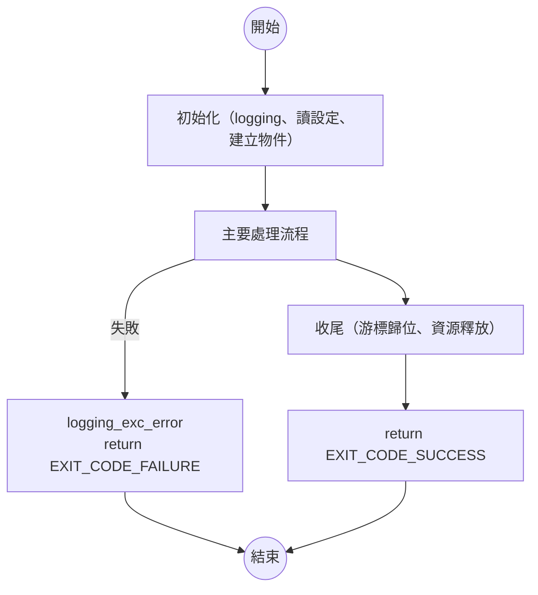

# 程式說明文件模版

## 標準作業流程

初始化 → 主流程 → 錯誤出口 → 正常出口

## 流程圖



### 描述碼

````script
flowchart TD
    s((開始)) --> step_init
    e((結束))

    step_init["初始化（logging、讀設定、建立物件）"] --> step_main
    step_main["主要處理流程"] --> step_finish

    step_main -->|失敗| step_error
    step_error["logging_exc_error<br/>return EXIT_CODE_FAILURE"] --> e

    step_finish["收尾（游標歸位、資源釋放）"] --> step_ok
    step_ok["return EXIT_CODE_SUCCESS"] --> e
` ```
````
