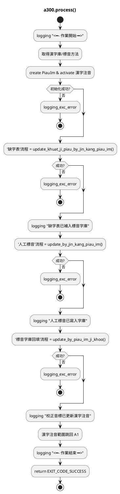
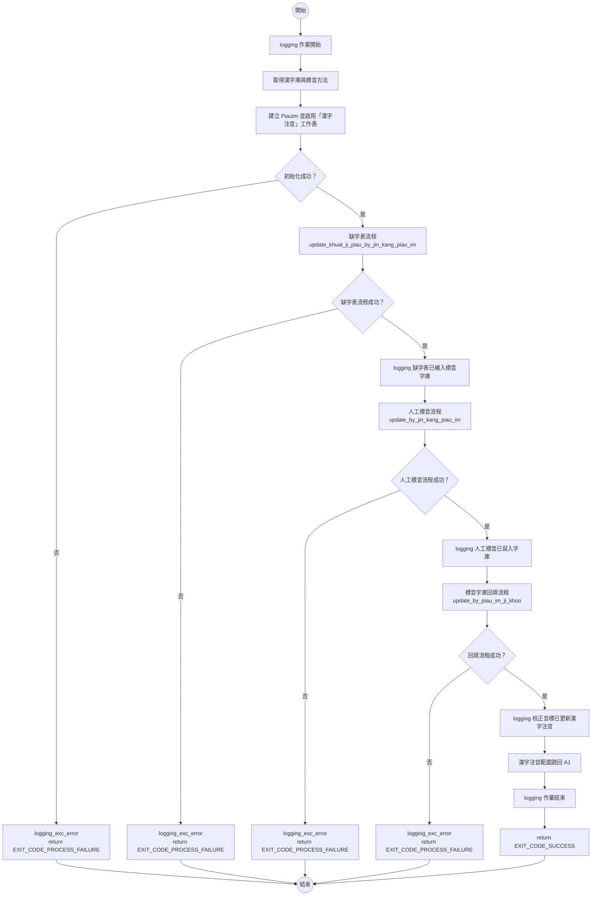
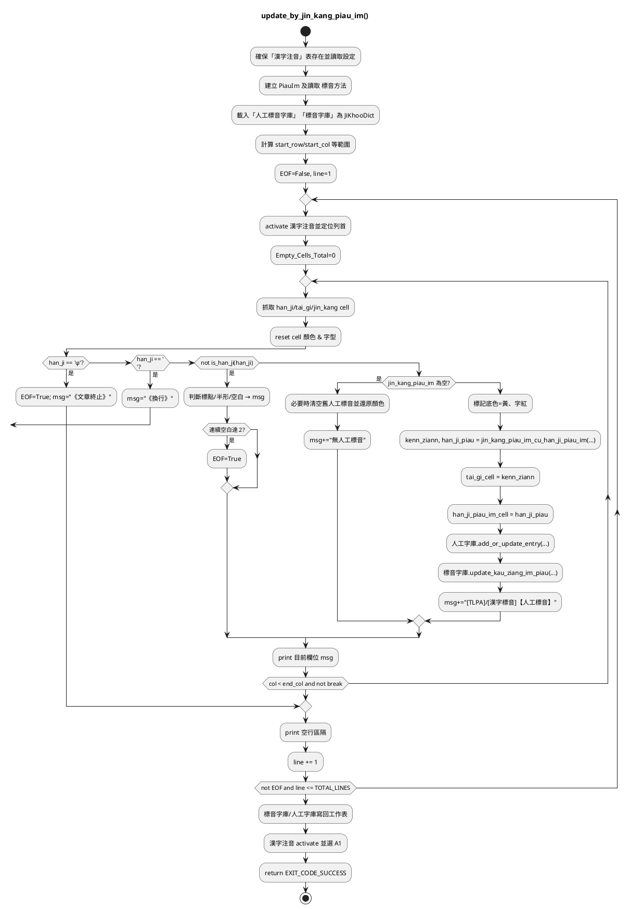
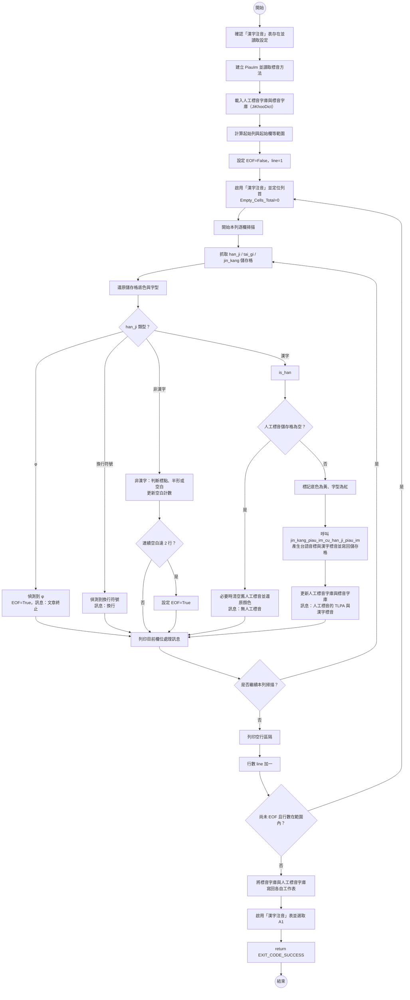

# 程式說明文件 a300 手動更正漢字標音

## process()

- 初始化：記錄開始、擷取 漢字庫 與 標音方法、建立 PiauIm、啟用 漢字注音 工作表；任一失敗直接回傳 EXIT_CODE_PROCESS_FAILURE。
- 缺字表補標音：呼叫 update_khuat_ji_piau_by_jin_kang_piau_im()，將缺字表資料同步到標音字庫；失敗即終止。
- 人工標音回填：呼叫 update_by_jin_kang_piau_im()，把「漢字注音」表的人工標音寫入字庫並反映在工作表。
- 校正音標覆寫：呼叫 update_by_piau_im_ji_khoo()，以標音字庫內的校正音標覆蓋「漢字注音」表的台語音標/漢字標音。
- 收尾：選取 A1、記錄結束訊息、回傳 EXIT_CODE_SUCCESS。

### 虛擬碼



### 流程圖



### Mermaid 腳本描述

```script
flowchart TD
    %% 入口/出口
    s((開始)) --> log_start
    e((結束))

    %% 主流程
    log_start["logging 作業開始"] --> get_conf
    get_conf["取得漢字庫與標音方法"] --> init_piauim
    init_piauim["建立 PiauIm 並啟用「漢字注音」工作表"] --> init_ok

    init_ok{"初始化成功？"} -->|否| err_init
    init_ok -->|是| step_khuatzi

    err_init["logging_exc_error<br/>return EXIT_CODE_PROCESS_FAILURE"] --> e

    step_khuatzi["缺字表流程<br/>update_khuat_ji_piau_by_jin_kang_piau_im"] --> step_khuatzi_ok
    step_khuatzi_ok{"缺字表流程成功？"} -->|否| err_khuatzi
    step_khuatzi_ok -->|是| log_khuatzi

    err_khuatzi["logging_exc_error<br/>return EXIT_CODE_PROCESS_FAILURE"] --> e
    log_khuatzi["logging 缺字表已補入標音字庫"] --> step_jinkang

    step_jinkang["人工標音流程<br/>update_by_jin_kang_piau_im"] --> step_jinkang_ok
    step_jinkang_ok{"人工標音流程成功？"} -->|否| err_jinkang
    step_jinkang_ok -->|是| log_jinkang

    err_jinkang["logging_exc_error<br/>return EXIT_CODE_PROCESS_FAILURE"] --> e
    log_jinkang["logging 人工標音已寫入字庫"] --> step_backfill

    step_backfill["標音字庫回填流程<br/>update_by_piau_im_ji_khoo"] --> step_backfill_ok
    step_backfill_ok{"回填流程成功？"} -->|否| err_backfill
    step_backfill_ok -->|是| log_backfill

    err_backfill["logging_exc_error<br/>return EXIT_CODE_PROCESS_FAILURE"] --> e
    log_backfill["logging 校正音標已更新漢字注音"] --> reset_a1

    reset_a1["漢字注音範圍跳回 A1"] --> log_end
    log_end["logging 作業結束"] --> ret_ok
    ret_ok["return EXIT_CODE_SUCCESS"] --> e
```

## update_by_jin_kang_piau_im()

- 初始化：鎖定「漢字注音」表、讀取 漢字庫／標音方法，建立 PiauIm。建立「人工標音字庫」「標音字庫」兩個 JiKhooDict。
- 設定表格範圍並進入雙層迴圈（行→列），逐一取出漢字、台語音標、人工標音儲存格，並先還原底色字色。
- 結束條件：遇 φ 設 EOF=True，遇 \n 視為換行跳出本列。對非漢字再判斷標點 / 英數 / 空白並計數空白行。
- 若為漢字：
- 無人工標音：若儲存格仍有舊值則清空並還原樣式。
- 有人工標音：標註底色，透過 jin_kang_piau_im_cu_han_ji_piau_im() 轉換成台語音標 + 漢字標音，寫回儲存格。
- 同步字庫：jinkang 字庫記錄 add_or_update_entry()；piau_im_ji_khoo.update_kau_ziang_im_piau() 更新校正音標。
- 內層每欄列印進度，外層每列換行，遇 EOF 或超過總行數即跳出。
- 收尾：把更新後的兩個字典寫回各自工作表，選取 A1，回傳成功。

### 虛擬碼



### 流程圖



### Mermaid 腳本描述

```script
flowchart TD
    %% 入口/出口
    s((開始)) --> init_sheet
    e((結束))

    %% 初始化
    init_sheet["確認「漢字注音」表存在並讀取設定"] --> init_piauim
    init_piauim["建立 PiauIm 並讀取標音方法"] --> load_dicts
    load_dicts["載入人工標音字庫與標音字庫（JiKhooDict）"] --> calc_range
    calc_range["計算起始列與起始欄等範圍"] --> init_state
    init_state["設定 EOF=False，line=1"] --> row_loop_start

    %% 外層：逐列處理
    row_loop_start["啟用「漢字注音」並定位列首<br/>Empty_Cells_Total=0"] --> col_loop_start

    %% 內層：逐欄處理
    col_loop_start["開始本列逐欄掃描"] --> get_cells

    get_cells["抓取 han_ji / tai_gi / jin_kang 儲存格"] --> reset_style
    reset_style["還原儲存格底色與字型"] --> decide_han_ji

    decide_han_ji{"han_ji 類型？"} -->|φ| seen_phi
    decide_han_ji -->|換行符號| seen_newline
    decide_han_ji -->|非漢字| non_han
    decide_han_ji -->|漢字| is_han

    %% φ → EOF
    seen_phi["偵測到 φ<br/>EOF=True，訊息：文章終止"] --> print_cell_msg
    %% 換行 → 跳出本列
    seen_newline["偵測到換行符號<br/>訊息：換行"] --> print_cell_msg

    %% 非漢字：標點/半形/空白
    non_han["非漢字：判斷標點、半形或空白<br/>更新空白計數"] --> maybe_row_eof
    maybe_row_eof{"連續空白達 2 行？"} -->|是| mark_eof
    maybe_row_eof -->|否| print_cell_msg

    mark_eof["設定 EOF=True"] --> print_cell_msg

    %% 漢字 → 看有無人工標音
    is_han --> has_jinkang
    has_jinkang{"人工標音儲存格為空？"} -->|是| clear_old
    has_jinkang -->|否| fill_manual

    clear_old["必要時清空舊人工標音並還原顏色<br/>訊息：無人工標音"] --> print_cell_msg

    fill_manual["標記底色為黃、字型為紅"] --> convert_writeback
    convert_writeback["呼叫 jin_kang_piau_im_cu_han_ji_piau_im<br/>產生台語音標與漢字標音並寫回儲存格"] --> sync_dicts
    sync_dicts["更新人工標音字庫與標音字庫<br/>訊息：人工標音的 TLPA 與漢字標音"] --> print_cell_msg

    %% 顯示本欄訊息
    print_cell_msg["列印目前欄位處理訊息"] --> decide_next_col

    %% 判斷是否繼續同一列
    decide_next_col{"是否繼續本列掃描？"} -->|是| get_cells
    decide_next_col -->|否| after_row

    %% 一列結束後
    after_row["列印空行區隔"] --> inc_line
    inc_line["行數 line 加一"] --> decide_next_row

    decide_next_row{"尚未 EOF 且行數在範圍內？"} -->|是| row_loop_start
    decide_next_row -->|否| write_back

    %% 收尾：寫回字典 & 選 A1
    write_back["將標音字庫與人工標音字庫寫回各自工作表"] --> select_a1
    select_a1["啟用「漢字注音」表並選取 A1"] --> ret_ok
    ret_ok["return EXIT_CODE_SUCCESS"] --> e
```
