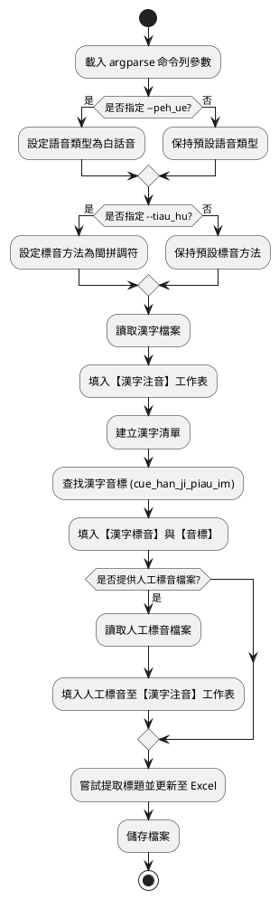
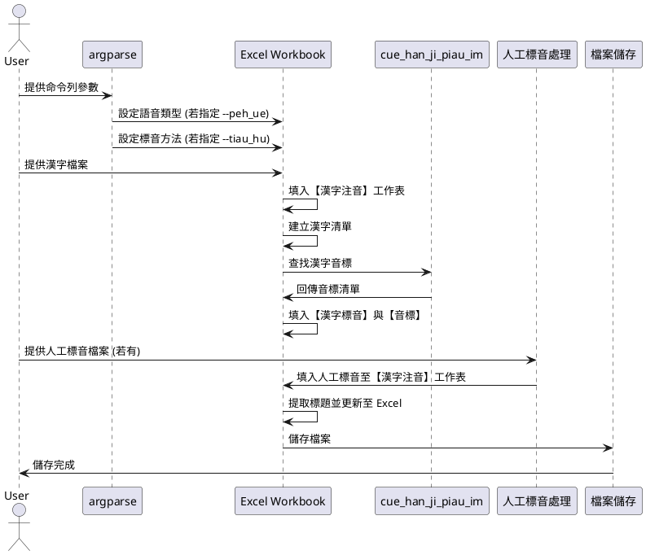

# a110 程式文件

a110_使用漢字文字檔流程圖

## 作業流程


```plantuml
@startuml
start
:載入 argparse 命令列參數;
if (是否指定 --peh_ue?) then (是)
    :設定語音類型為白話音;
else (否)
    :保持預設語音類型;
endif

if (是否指定 --tiau_hu?) then (是)
    :設定標音方法為閩拼調符;
else (否)
    :保持預設標音方法;
endif

:讀取漢字檔案;
:填入【漢字注音】工作表;

:建立漢字清單;
:查找漢字音標 (cue_han_ji_piau_im);
:填入【漢字標音】與【音標】;

if (是否提供人工標音檔案?) then (是)
    :讀取人工標音檔案;
    :填入人工標音至【漢字注音】工作表;
endif

:嘗試提取標題並更新至 Excel;
:儲存檔案;
stop
@enduml

```

## 循序圖


```plantuml
@startuml
actor User
participant "argparse" as Argparse
participant "Excel Workbook" as Workbook
participant "cue_han_ji_piau_im" as CueHanJi
participant "人工標音處理" as ManualPiauIm
participant "檔案儲存" as SaveFile

User -> Argparse: 提供命令列參數
Argparse -> Workbook: 設定語音類型 (若指定 --peh_ue)
Argparse -> Workbook: 設定標音方法 (若指定 --tiau_hu)

User -> Workbook: 提供漢字檔案
Workbook -> Workbook: 填入【漢字注音】工作表
Workbook -> Workbook: 建立漢字清單

Workbook -> CueHanJi: 查找漢字音標
CueHanJi -> Workbook: 回傳音標清單
Workbook -> Workbook: 填入【漢字標音】與【音標】

User -> ManualPiauIm: 提供人工標音檔案 (若有)
ManualPiauIm -> Workbook: 填入人工標音至【漢字注音】工作表

Workbook -> Workbook: 提取標題並更新至 Excel
Workbook -> SaveFile: 儲存檔案
SaveFile -> User: 儲存完成
@enduml
```
:儲存檔案;
stop
@enduml
```

