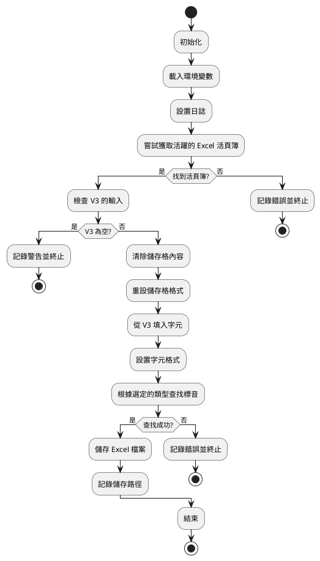
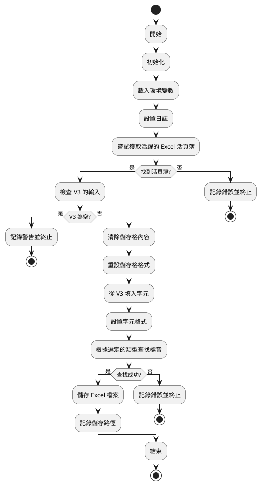

# a100 程式執行流程

1. 開始

    - 開始程式

2. 初始化

    - 讀取環境變數
    - 設定日誌

3. 獲取活頁簿

   - 嘗試獲取當前活躍的 Excel 活頁簿
   - 如果失敗，記錄錯誤並終止程式

4. 檢查輸入

   - 從 V3 儲存格獲取待注音漢字
   - 如果 V3 為空，記錄警告並終止程式

5. 清除及重設格式

   - 清除儲存格內容
   - 重設儲存格格式

6. 填入漢字

   - 從 V3 逐字填入對應儲存格
   - 設定字元格式（顏色等）

7. 查找標音

   - 根據選定的語音類型查找標音
   - 如果查找失敗，記錄錯誤並終止程式

8. 儲存檔案

   - 儲存 Excel 檔案
   - 記錄儲存路徑

9. 結束

   - 結束程式

## PlantUML 流程圖

使用 PlantUML Script 繪製【流程圖】。

### 程式主要架構流程

### 程式細節架構流程

