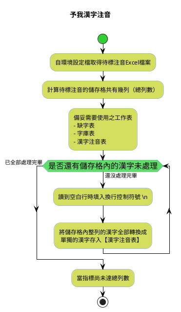

# 予我漢字注音

```plantuml
@startuml
skinparam shadowing false

title 予我漢字注音\n

skinparam activity {
    StartColor limegreen
    EndColor darkblue
    BackgroundColor #d4de5e
    BorderColor #5e94de
    ArrowColor black
}
skinparam activityDiamond {
    BackgroundColor #5ede68
    BorderColor #5e94de
    fontSize 16
}

start
:自環境設定檔取得待標注音Excel檔案;
:計算待標注音的儲存格共有幾列（總列數）;
:備妥需要使用之工作表
- 缺字表
- 字庫表
- 漢字注音表;

while (是否還有儲存格內的漢字未處理) is (還沒處理完畢)
    :讀到空白行時填入換行控制符號 \\n;
    
    :將儲存格內整列的漢字全部轉換成
     單獨的漢字存入【漢字注音表】;
endwhile (已全部處理完畢)

:當指標尚未達總列數;

stop

@enduml
```