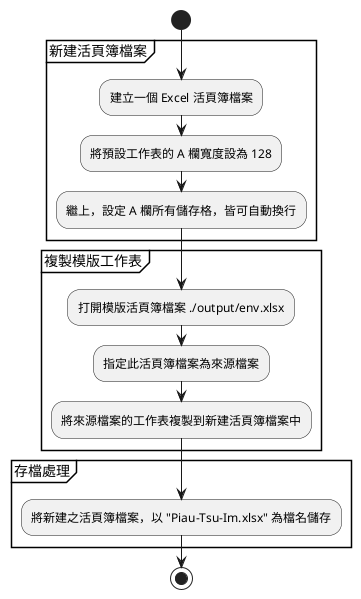

# m100 建立標注音檔案

```plantuml
@startuml
start

partition 新建活頁簿檔案 {
    :建立一個 Excel 活頁簿檔案;
    :將預設工作表的 A 欄寬度設為 128;
    :繼上，設定 A 欄所有儲存格，皆可自動換行;
}

' 自 output 子目錄、env.xlsx 活頁簿檔案，抄錄 env 工作表;
partition 複製模版工作表 {
    :打開模版活頁簿檔案 ./output/env.xlsx;
    :指定此活頁簿檔案為來源檔案;
    :將來源檔案的工作表複製到新建活頁簿檔案中;
}

partition 存檔處理 {
    :將新建之活頁簿檔案，以 "Piau-Tsu-Im.xlsx" 為檔名儲存;
}

stop
@enduml
```