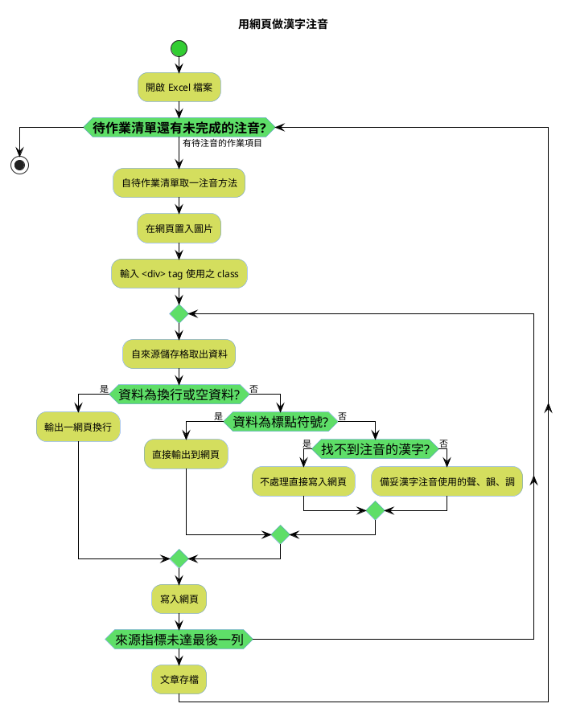

# 用網頁做漢字注音

```plantuml
@startuml
skinparam shadowing false

skinparam activity {
    StartColor limegreen
    EndColor darkblue
    BackgroundColor #d4de5e
    BorderColor #5e94de
    ArrowColor black
}
skinparam activityDiamond {
    BackgroundColor #5ede68
    BorderColor #5e94de
    fontSize 16
}

title 用網頁做漢字注音

start

:開啟 Excel 檔案;

while (<b>待作業清單還有未完成的注音?) is (有待注音的作業項目)
    :自待作業清單取一注音方法;
    :在網頁置入圖片;
    :輸入 <div> tag 使用之 class;
    repeat 
        :自來源儲存格取出資料;
        
        if (資料為換行或空資料?) then (是)
            :輸出一網頁換行;
        else (否)
            if (資料為標點符號?) then (是)
                :直接輸出到網頁;
            else (否)
                if (找不到注音的漢字?) then (是)
                    :不處理直接寫入網頁;
                else (否)
                    :備妥漢字注音使用的聲、韻、調;
                endif
            endif
        endif
        :寫入網頁;
    repeat while (來源指標未達最後一列)
    :文章存檔;
endwhile
stop

@enduml
```