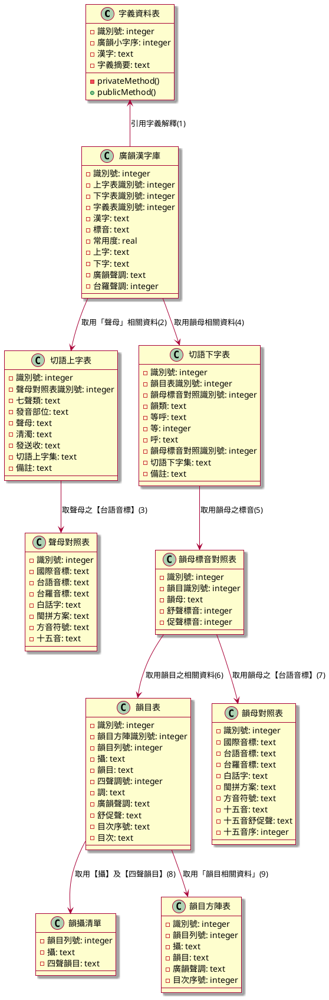

# 廣韻字典資料模型

## 用途說明

### (1) 廣韻漢字庫 -->  字義資料表

透過【字義識別號】取：【字義摘要】

### (2) 廣韻漢字庫 -->  切語上字表

透過【上字表識別號】取：

- 聲母
- 聲母標音
- 七聲類
- 清濁
- 發送收

### (3) 切語上字表 --> 聲母對照表

透過【切語上字表】之【聲母】欄位（存放【聲母對照表識別號】），參考【聲母對照表】之【識別號】取用以欄位資料：

- 韻母
- 韻母標音
- 韻目列號
- 攝
- 調
- 目次
- 韻目
- 等呼
- 等
- 呼

### (4) 廣韻漢字庫 -->  切語下字表

透過【廣韻漢字庫】之【下字表識別號】參考【切語下字表】之【識別號】，取用以下欄位資料：

- 韻母
- 韻母標音
- 韻目列號
- 攝
- 調
- 目次
- 韻目
- 等呼
- 等
- 呼

### (5) 切語下字表 --> 韻母標音對照表

透過【切語下字表】之【韻母】欄位（存放【韻母對照表識別號】），參考【韻母對照表】之【識別號】取用以欄位資料：

- 舒聲標音
- 促聲標音

### (6) 韻母標音對照表 --> 韻目表

透過【韻母標音對照表】之【韻目識別號】，參考【韻目表】之【識別號】，取用韻目相關資料：

- 韻目列號
- 攝
- 韻目
- 四聲調號
- 調
- 廣韻聲調
- 舒促聲
- 目次序號
- 目次

### (7) 韻母標音對照表 --> 韻母對照表

透過【韻母標音對照表】之【舒聲標音】、【促聲標音】參考【韻母對照表】之【識別號】取用【台語音標】資料。

- 舒聲標音：存放【韻母對照表識別號】
- 促聲標音：存放【韻母對照表識別號】

### (8) 韻目表 --> 韻攝清單

透過【韻目表】之【韻目列號】，參考【韻攝清單】之【韻目列號】取：

- 攝
- 四聲韻目

### (9) 韻目表 --> 韻目方陣表

透過【韻目表】之【韻目方陣識別號】，參考【韻目方陣】之【識別號】取：

- 韻目列號
- 攝
- 韻目
- 四聲調號: ？
- 調: ?
- 廣韻聲調: ?
- 舒促聲: ?
- 目次序號
- 目次: ?