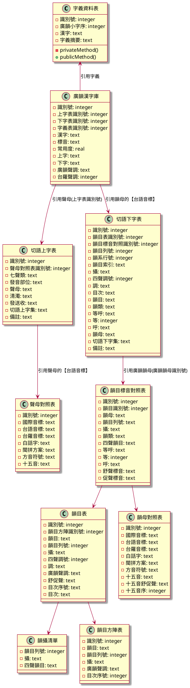

# 廣韻字典資料模型

```plantuml
@startuml
skin rose

class 字義資料表 {
    - 識別號: integer
    - 廣韻小字序: integer
    - 漢字: text
    - 字義摘要: text

    -privateMethod()
    +publicMethod()
}

字義資料表 <-- 廣韻漢字庫 : 引用字義

class 廣韻漢字庫 {
    - 識別號: integer
    - 上字表識別號: integer
    - 下字表識別號: integer
    - 字義表識別號: integer
    - 漢字: text
    - 標音: text
    - 常用度: real
    - 上字: text
    - 下字: text
    - 廣韻聲調: text
    - 台羅聲調: integer
}

廣韻漢字庫 --> 切語上字表 : 引用聲母(上字表識別號)

class 切語上字表 {
    - 識別號: integer
    - 聲母對照表識別號: integer
    - 七聲類: text
    - 發音部位: text
    - 聲母: text
    - 清濁: text
    - 發送收: text
    - 切語上字集: text
    - 備註: text
}

切語上字表 --> 聲母對照表 : 引用聲母的【台語音標】

class 聲母對照表 {
    - 識別號: integer
    - 國際音標: text
    - 台語音標: text
    - 台羅音標: text
    - 白話字: text
    - 閩拼方案: text
    - 方音符號: text
    - 十五音: text
}

廣韻漢字庫 --> 切語下字表 : 引用韻母的【台語音標】

class 切語下字表 {
    - 識別號: integer
    - 韻目表識別號: integer
    - 韻目標音對照識別號: integer
    - 韻目列號: integer
    - 韻系行號: integer
    - 韻目索引: text
    - 攝: text
    - 四聲調號: integer
    - 調: text
    - 目次: text
    - 韻目: text
    - 韻類: text
    - 等呼: text
    - 等: integer
    - 呼: text
    - 韻母: text
    - 切語下字集: text
    - 備註: text
}

切語下字表 --> 韻目標音對照表 : 引用廣韻韻母(廣韻韻母識別號)

class 韻目標音對照表 {
    - 識別號: integer
    - 韻目識別號: integer
    - 韻母: text
    - 韻目列號: text
    - 攝: text
    - 韻類: text
    - 四聲韻目: text
    - 等呼: text
    - 等: integer
    - 呼: text
    - 舒聲標音: text
    - 促聲標音: text
}

韻目標音對照表 --> 韻目表

class 韻目表 {
    - 識別號: integer
    - 韻目方陣識別號: integer
    - 韻目: text
    - 韻目列號: integer
    - 攝: text
    - 四聲調號: integer
    - 調: text
    - 廣韻聲調: text
    - 舒促聲: text
    - 目次序號: text
    - 目次: text
}

韻目表 --> 韻攝清單

class 韻攝清單 {
    - 韻目列號: integer
    - 攝: text
    - 四聲韻目: text
}

韻目表 --> 韻目方陣表

class 韻目方陣表 {
    - 識別號: integer
    - 韻目: text
    - 韻目列號: integer
    - 攝: text
    - 廣韻聲調: text
    - 目次序號: integer
}


韻目標音對照表 --> 韻母對照表

class 韻母對照表 {
    - 識別號: integer
    - 國際音標: text
    - 台語音標: text
    - 台羅音標: text
    - 白話字: text
    - 閩拼方案: text
    - 方音符號: text
    - 十五音: text
    - 十五音舒促聲: text
    - 十五音序: integer
}

@enduml
```
