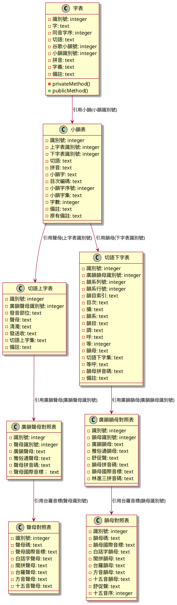

# 廣韻切語字典資料模型

```plantuml
@startuml
skin rose

class 字表 {
- 識別號: integer
- 字: text
- 同音字序: integer
- 切語: text
- 谷歌小韻號: integer
- 小韻識別號: integer
- 拼音: text
- 字義: text
- 備註: text

-privateMethod()
+publicMethod()
}

字表 --> 小韻表 : 引用小韻(小韻識別號)

class 小韻表 {
- 識別號: integer
- 上字表識別號: integer
- 下字表識別號: integer
- 切語: text
- 拼音: text
- 小韻字: text
- 目次編碼: text
- 小韻字序號: integer
- 小韻字集: text
- 字數: integer
- 備註: text
- 原有備註: text
}

小韻表 --> 切語上字表 : 引用聲母(上字表識別號)

class 切語上字表 {
- 識別號: integer
- 廣韻聲母識別號: integer
- 發音部位: text
- 聲母: text
- 清濁: text
- 發送收: text
- 切語上字集: text
- 備註: text
}

切語上字表 --> 廣韻聲母對照表 : 引用廣韻聲母(廣韻聲母識別號)

class 廣韻聲母對照表 {
- 識別號: integr
- 聲母識別號: integer
- 廣韻聲母: text
- 雅俗通聲母: text
- 聲母拼音碼: text
- 聲母國際音標： text
}

廣韻聲母對照表 --> 聲母對照表 : 引用台羅音標(聲母識別號)

class 聲母對照表 {
- 識別號: integer
- 聲母碼: text
- 聲母國際音標: text
- 白話字聲母: text
- 閩拼聲母: text
- 台羅聲母: text
- 方音聲母: text
- 十五音聲母: text
}

小韻表 --> 切語下字表 : 引用韻母(下字表識別號)

class 切語下字表 {
- 識別號: integer
- 廣韻韻母識別號: integer
- 韻系列號: integer
- 韻系行號: integer
- 韻目索引: text
- 目次: text
- 攝: text
- 韻系: text
- 韻目: text
- 調: text
- 呼: text
- 等: integer
- 韻母: text
- 切語下字集: text
- 等呼: text
- 韻母拼音碼: text
- 備註: text
}

切語下字表 --> 廣韻韻母對照表 : 引用廣韻韻母(廣韻韻母識別號)

class 廣韻韻母對照表 {
- 識別號: integer
- 韻母識別號: integer
- 廣韻韻母: text
- 雅俗通韻母: text
- 舒促聲: text
- 韻母拼音碼: text
- 韻母國際音標: text
- 林進三拼音碼: text
}

廣韻韻母對照表 --> 韻母對照表 : 引用台羅音標(韻母識別號)

class 韻母對照表 {
- 識別號: integer
- 韻母碼: text
- 韻母國際音標: text
- 白話字韻母: text
- 閩拼韻母: text
- 台羅韻母: text
- 方音韻母: text
- 十五音韻母: text
- 舒促聲: text
- 十五音序: integer
}

@enduml
```