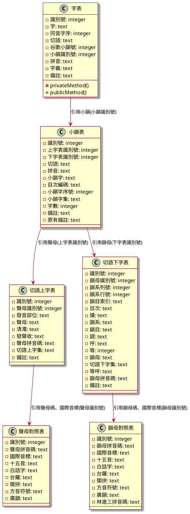

# 廣韻切語字典資料模型



## 查詢漢字拼音碼(注音)需求

查詢某漢字之`[拼音]`, 需要以下欄位之資料:

1. 來自 '字表' 資料表的以下欄位：

   - 識別號: integer
   - 字: text
   - 同音字序: integer
   - 切語: text
   - 拼音: text
   - 字義: text

2. 來自 '小韻表' 資料表的以下欄位：

   - 小韻字: text
   - 目次編碼: text
   - 小韻字序號: integer
   - 小韻字集: text
   - 字數: integer

3. 來自 '切語上字表' 資料表的以下欄位：

   - 發音部位: text
   - 聲母: text
   - 清濁: text
   - 發聲收: text
   - 聲母拼音碼: text
   - 切語上字集: text

4. 來自 '聲母對照表' 資料表的以下欄位：

   - 聲母拼音碼: text
   - 國際音標: text
   - 十五音: text

5. 來自 '切語下字表' 資料表的以下欄位：

   - 韻系列號: integer
   - 韻系行號: integer
   - 韻目索引: text
   - 目次: text
   - 攝: text
   - 韻系: text
   - 韻目: text
   - 調: text
   - 呼: text
   - 等: integer
   - 韻母: text
   - 切語下字集: text
   - 等呼: text

6. 來自 '韻母對照表' 資料表的以下欄位：

   - 韻母拼音碼: text
   - 國際音標: text
   - 十五音: text

## 建置檢視

```sh
CREATE VIEW 檢視測試 AS
SELECT
    識別號,
    字,
    同音字序,
    切語,
    拼音,
    字義
FROM 字表
```

## 建置小韻查詢

```sh
CREATE VIEW 小韻查詢 AS
SELECT
    小韻表.小韻字,
  	小韻表.切語,
	小韻表.拼音,
    小韻表.目次編碼,
    小韻表.小韻字序號,
    小韻表.小韻字集,
    小韻表.字數,
    切語上字表.發音部位,
    切語上字表.聲母,
    切語上字表.清濁,
    切語上字表.發送收,
    切語上字表.聲母拼音碼 AS 聲母標音,
    切語上字表.切語上字集,
    切語下字表.韻系列號,
    切語下字表.韻系行號,
    切語下字表.韻目索引,
    切語下字表.目次,
    切語下字表.攝,
    切語下字表.韻系,
    切語下字表.韻目,
    切語下字表.調,
    切語下字表.呼,
    切語下字表.等,
    切語下字表.韻母,
    切語下字表.切語下字集,
    切語下字表.等呼,
    切語下字表.韻母拼音碼 AS 韻母標音
FROM 小韻表
JOIN 切語上字表 ON 小韻表.上字表識別號 = 切語上字表.識別號
JOIN 切語下字表 ON 小韻表.下字表識別號 = 切語下字表.識別號;
```

## 建置漢字查廣韻標音

```sh
CREATE VIEW 漢字查廣韻標音 AS
SELECT
    字表.識別號,
    字表.字,
    字表.同音字序,
    字表.切語,
    字表.拼音 AS 漢字標音,
    字表.字義,
    小韻表.小韻字,
    小韻表.目次編碼,
    小韻表.小韻字序號,
    小韻表.小韻字集,
    小韻表.字數,
    切語上字表.發音部位,
    切語上字表.聲母,
    切語上字表.清濁,
    切語上字表.發送收,
    切語上字表.聲母拼音碼 AS 上字標音,
    切語上字表.切語上字集,
    切語下字表.韻系列號,
    切語下字表.韻系行號,
    切語下字表.韻目索引,
    切語下字表.目次,
    切語下字表.攝,
    切語下字表.韻系,
    切語下字表.韻目,
    切語下字表.調,
    切語下字表.呼,
    切語下字表.等,
    切語下字表.韻母,
    切語下字表.切語下字集,
    切語下字表.等呼,
    切語下字表.韻母拼音碼 AS 下字標音
FROM 字表
JOIN 小韻表 ON 字表.小韻識別號 = 小韻表.識別號
JOIN 切語上字表 ON 小韻表.上字表識別號 = 切語上字表.識別號
JOIN 切語下字表 ON 小韻表.下字表識別號 = 切語下字表.識別號;
```
