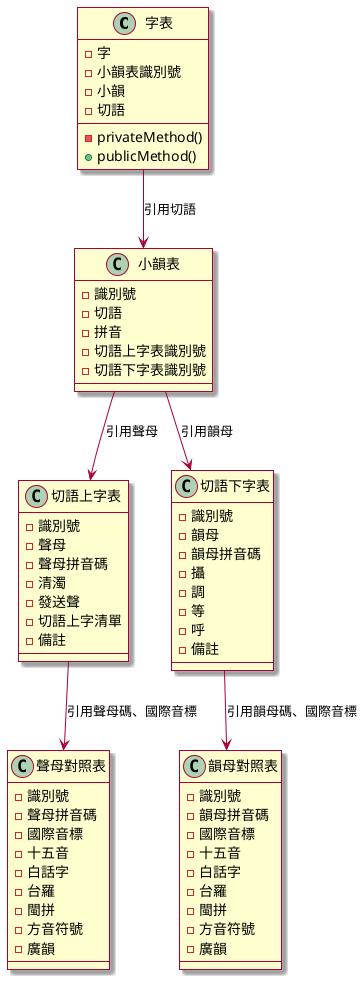

# 廣韻切語字典資料模型

```plantuml
@startuml
skin rose

class 字表 {
 - 字
 - 小韻表識別號
 - 小韻
 - 切語

 -privateMethod()
 +publicMethod()
}

class 小韻表 {
    - 識別號
    - 切語
    - 拼音
    - 切語上字表識別號
    - 切語下字表識別號
}

class 切語上字表 {
    - 識別號
    - 聲母
    - 聲母拼音碼
    - 清濁
    - 發送聲
    - 切語上字清單
    - 備註
}

class 聲母對照表 {
    - 識別號
    - 聲母拼音碼
    - 國際音標
    - 十五音
    - 白話字
    - 台羅
    - 閩拼
    - 方音符號
    - 廣韻
}

class 切語下字表 {
    - 識別號
    - 韻母
    - 韻母拼音碼
    - 攝
    - 調
    - 等
    - 呼
    - 備註
}

class 韻母對照表 {
    - 識別號
    - 韻母拼音碼
    - 國際音標
    - 十五音
    - 白話字
    - 台羅
    - 閩拼
    - 方音符號
    - 廣韻
}

字表 --> 小韻表 : 引用切語

小韻表 --> 切語上字表 : 引用聲母
小韻表 --> 切語下字表 : 引用韻母

切語上字表 --> 聲母對照表 : 引用聲母碼、國際音標
切語下字表 --> 韻母對照表 : 引用韻母碼、國際音標

@enduml
```
