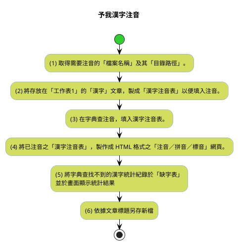

# 予我漢字注音

```plantuml
@startuml
skinparam shadowing false

title 予我漢字注音\n

skinparam activity {
    StartColor limegreen
    EndColor darkblue
    BackgroundColor #d4de5e
    BorderColor #5e94de
    ArrowColor black
}
skinparam activityDiamond {
    BackgroundColor #5ede68
    BorderColor #5e94de
    fontSize 16
}

start
:(1) 取得需要注音的「檔案名稱」及其「目錄路徑」。;

:(2) 將存放在「工作表1」的「漢字」文章，製成「漢字注音表」以便填入注音。;

:(3) 在字典查注音，填入漢字注音表。;

:(4) 將已注音之「漢字注音表」，製作成 HTML 格式之「注音／拼音／標音」網頁。;

:(5) 將字典查找不到的漢字統計紀錄於「缺字表」
並於畫面顯示統計結果;

:(6) 依據文章標題另存新檔;
stop

@enduml
```